# Лабораторная работа: хэш-структуры на Go

Реализованы **файловая хэш-таблица** на диске (бакеты-файлы), **идеальное хэширование (CHD)** для фиксированного набора ключей и **LSH** для поиска близких точек в **ℝ³**.

---

## Зависимость от N, память, сравнение LSH и наивного метода

### Рис. 1–2. Perfect hash: построение индекса

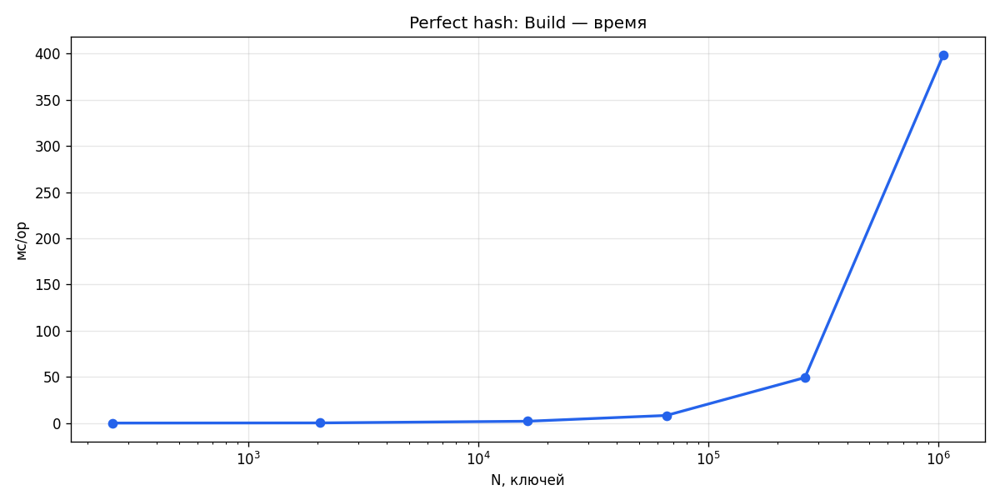

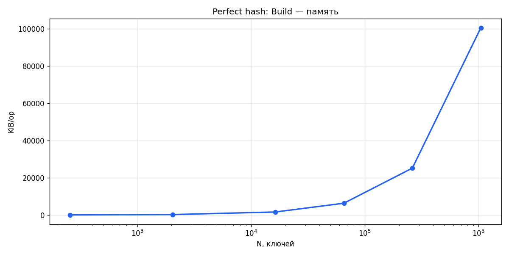

### Рис. 3–4. Perfect hash: поиск

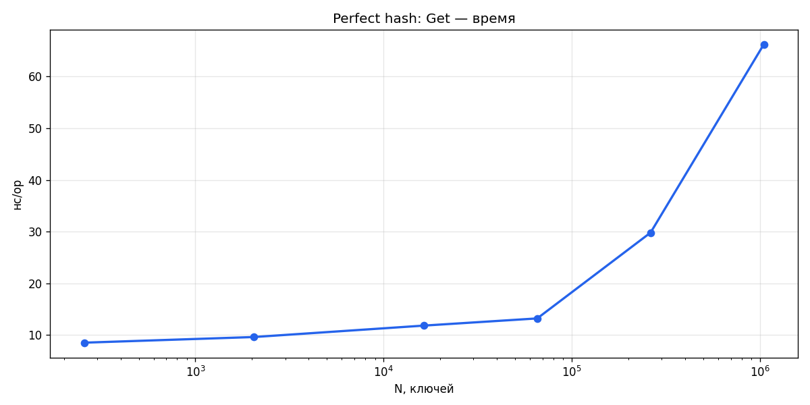

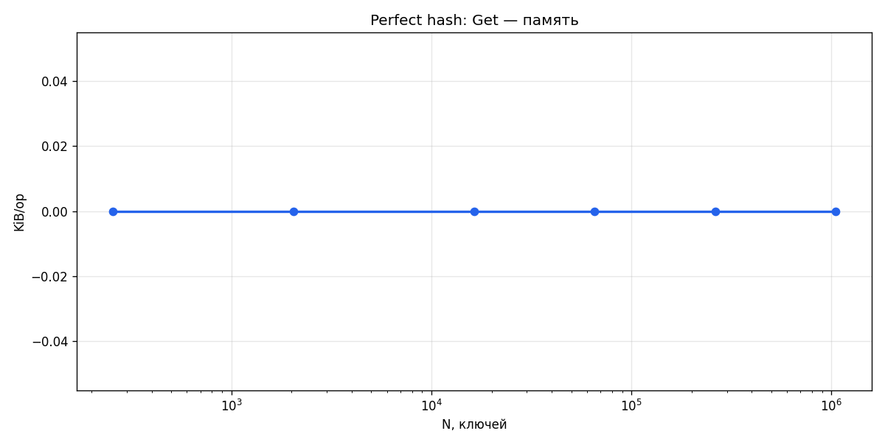

### Рис. 5–8. LSH и наивный перебор

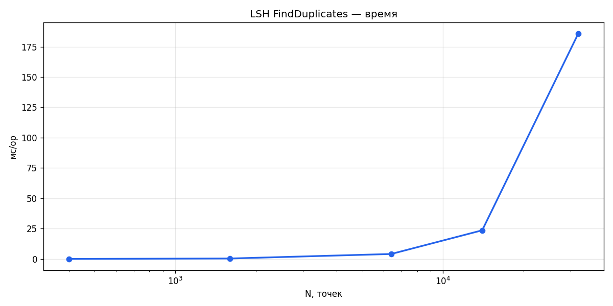

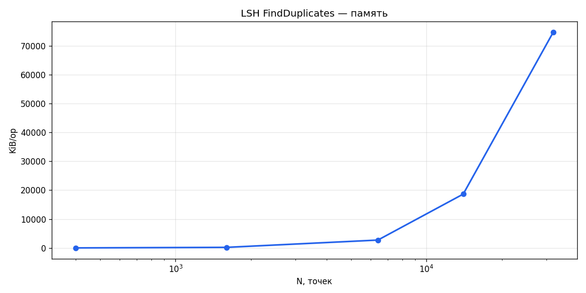

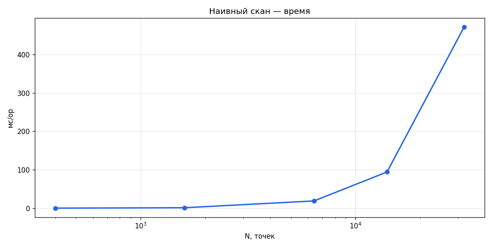

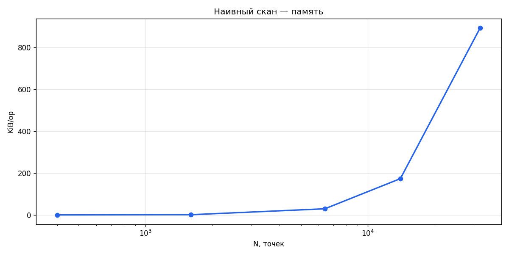

### Рис. 9. LSH vs наивный

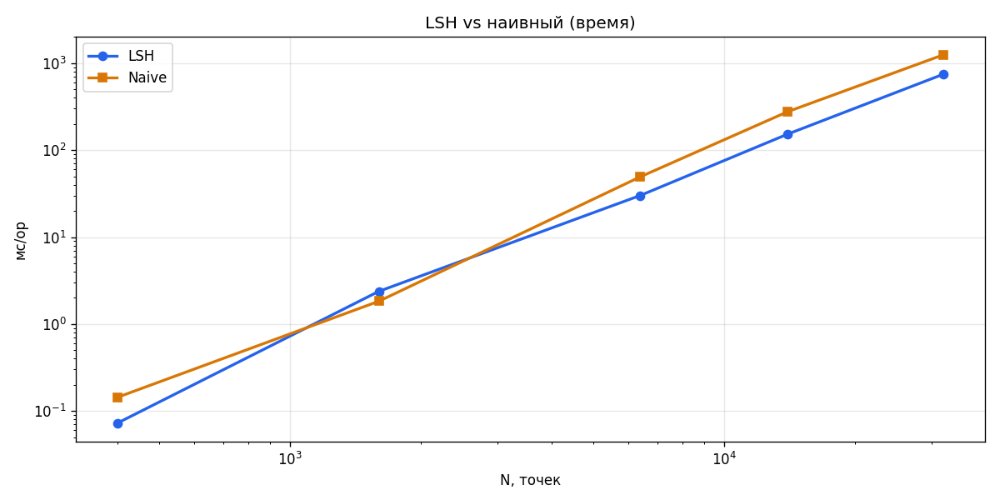

### Рис. 10. Диск: Set и Get (рост N)

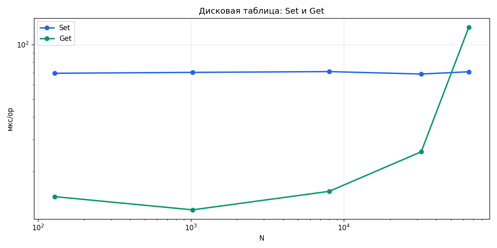

### Рис. 11–12. Диск: задержка Set и Get (нс/op ± σ)

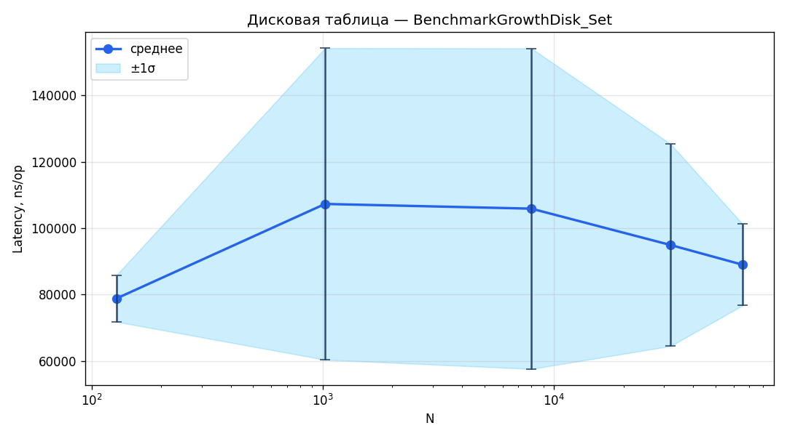

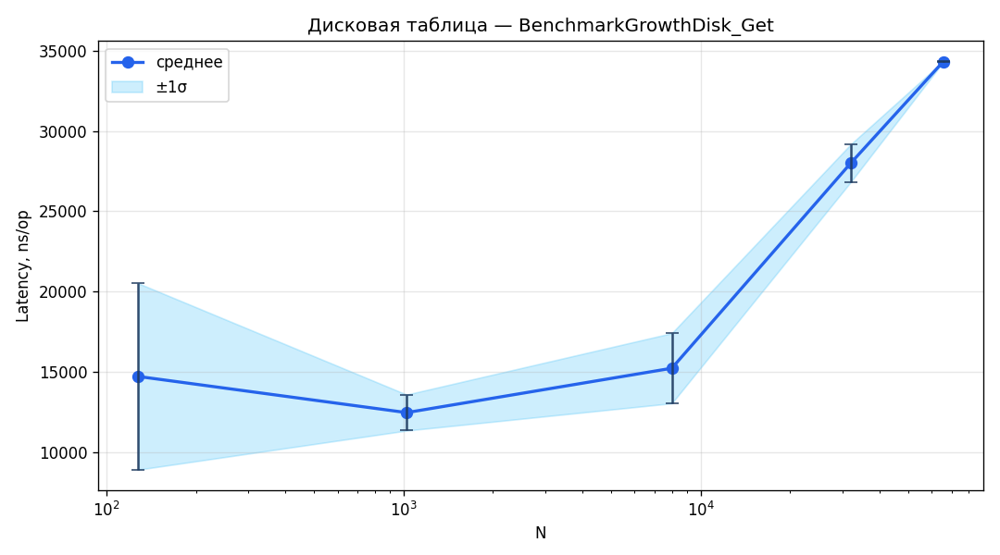

---

## Таблицы: дисковая таблица (нс/op ± σ)

### Таблица 1. Set

| N | нс/op | B/op | ~ op/с |
|---|-------|------|--------|
| 128 | 78 792 ± 7 003 | 1758 | 12 692 |
| 1024 | 107 298 ± 46 954 | 1960 | 9 320 |
| 8000 | 105 878 ± 48 303 | 2329 | 9 445 |
| 32000 | 94 917 ± 30 453 | 2462 | 10 536 |
| 65536 | 88 985 ± 12 290 | 2421 | 11 238 |

### Таблица 2. Get

| N | нс/op | B/op | ~ op/с |
|---|-------|------|--------|
| 128 | 14 703 ± 5 805 | 1471 | 68 016 |
| 1024 | 12 452 ± 1 121 | 1592 | 80 312 |
| 8000 | 15 217 ± 2 186 | 5799 | 65 718 |
| 32000 | 27 992 ± 1 177 | 22690 | 35 725 |
| 65536 | 34 317 ± 30 | 43942 | 29 140 |

Текстовая версия таблиц: `results/disk_bench_table.md`.
