# Лабораторная 1

Три реализации:
- файловая хэш-таблица с бакетами и операциями `Set` / `Update` / `Delete` / `Get`;
- статический perfect hash для фиксированного набора ключей;
- LSH для поиска дублей среди 3D-точек с exact-проверкой кандидатов.

Ниже сравнение этих структур по времени, памяти и профилям. Во всех growth-таблицах и на графиках показаны средние значения и `±3σ`, а flamegraph-ы помогают понять, где упор в I/O, аллокации или вычисления.

---

## 1. Файловая хэш-таблица

Реализация хранит каждый бакет как append-only log: `Set` и `Delete` дописывают запись в per-bucket буфер и сбрасывают его батчами, `Get` читает из in-memory `map` после загрузки бакета, а compaction перепаковывает только тот бакет, где накопилось слишком много stale-записей. В write-бенчмарках в таймер входит явный batched `Flush`, но не `Close`, поэтому график показывает амортизированную запись батча на диск без артефакта закрытия файлов. Это важная оговорка: показанный ниже `Get` — именно steady-state тёплого бакета. Холодный первый доступ к незагруженному бакету здесь не `O(1)`, а replay его файла.

<!-- TBL_DISK -->

**Insert**

| N | ns/op (±3σ) | B/op (±3σ) | ~ op/s |
|---|---|---|---|
| 2048 | 5 398 ± 2 400 | 159 ± 16.9 | 185 256 |
| 4096 | 6 799 ± 5 869 | 150 ± 21.9 | 147 077 |
| 8192 | 7 486 ± 9 803 | 158 ± 30.1 | 133 587 |
| 16384 | 15 333 ± 26 672 | 172 ± 13.6 | 65 218 |
| 32768 | 34 867 ± 46 819 | 188 ± 53.7 | 28 680 |
| 65536 | 48 080 ± 20 825 | 248 ± 23.3 | 20 799 |
| 131072 | 51 406 ± 20 744 | 264 ± 13.1 | 19 453 |
| 262144 | 57 115 ± 20 539 | 307 ± 6.0 | 17 509 |

**Update**

| N | ns/op (±3σ) | B/op (±3σ) | ~ op/s |
|---|---|---|---|
| 2048 | 5 333 ± 4 478 | 29 ± 9.5 | 187 526 |
| 4096 | 4 238 ± 1 442 | 35 ± 9.6 | 235 980 |
| 8192 | 4 323 ± 2 117 | 51 ± 5.1 | 231 326 |
| 16384 | 3 880 ± 891.5 | 71 ± 10.9 | 257 712 |
| 32768 | 4 005 ± 11 054 | 81 ± 14.1 | 249 710 |
| 65536 | 33 212 ± 30 177 | 158 ± 45.2 | 30 110 |
| 131072 | 50 006 ± 26 424 | 229 ± 19.6 | 19 998 |
| 262144 | 61 285 ± 33 771 | 268 ± 13.2 | 16 317 |

**Delete**

| N | ns/op (±3σ) | B/op (±3σ) | ~ op/s |
|---|---|---|---|
| 2048 | 6 128 ± 3 766 | 62 ± 8.3 | 163 177 |
| 4096 | 7 399 ± 6 135 | 65 ± 10.6 | 135 156 |
| 8192 | 7 378 ± 4 223 | 66 ± 9.5 | 135 543 |
| 16384 | 12 975 ± 16 025 | 80 ± 18.9 | 77 070 |
| 32768 | 32 727 ± 22 636 | 146 ± 42.0 | 30 556 |
| 65536 | 48 390 ± 18 308 | 218 ± 18.4 | 20 665 |
| 131072 | 61 178 ± 43 621 | 269 ± 9.5 | 16 346 |
| 262144 | 59 785 ± 20 522 | 280 ± 9.8 | 16 727 |

**Get**

| N | ns/op (±3σ) | B/op (±3σ) | ~ op/s |
|---|---|---|---|
| 2048 | 18.1 ± 2.7 | 0 ± 0.0 | 55 269 994 |
| 4096 | 17.4 ± 1.0 | 0 ± 0.0 | 57 580 469 |
| 8192 | 17.6 ± 1.5 | 0 ± 0.0 | 56 952 473 |
| 16384 | 17.8 ± 1.4 | 0 ± 0.0 | 56 038 106 |
| 32768 | 17.6 ± 1.2 | 0 ± 0.0 | 56 713 455 |
| 65536 | 18.2 ± 2.2 | 0 ± 0.0 | 55 084 279 |
| 131072 | 18.4 ± 2.6 | 0 ± 0.0 | 54 469 198 |
| 262144 | 17.9 ± 1.8 | 0 ± 0.0 | 55 784 893 |

<!-- /TBL_DISK -->

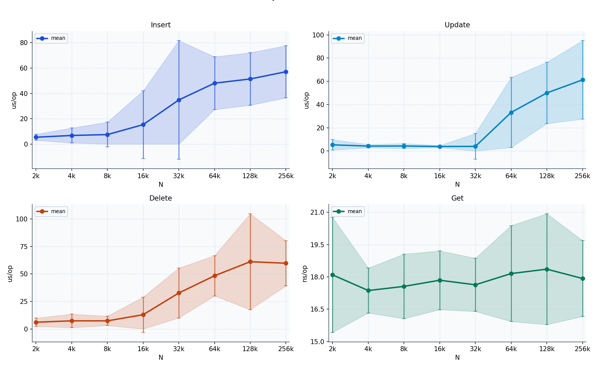

Что здесь хорошо:
- `Get` плоский по всему диапазону: значения держатся примерно в коридоре `17.4-18.4 ns/op`, что хорошо согласуется с ожидаемым warm-lookup `O(1)`.
- `Insert` / `Update` / `Delete` на малых `N` держатся почти на полке, а потом упираются не в поиск ключа, а в append/write-path и локальные compaction-ы.

Что здесь неидеально:
- это не extendible hashing и не линейное хеширование: число бакетов фиксируется при создании, split/merge бакетов нет;
- write-path после `32k` заметно дорожает, то есть структура уже ограничена файловым I/O и рабочим множеством, а не только хешированием;
- график честно описывает горячий read-path, но не cold-start latency бакета.

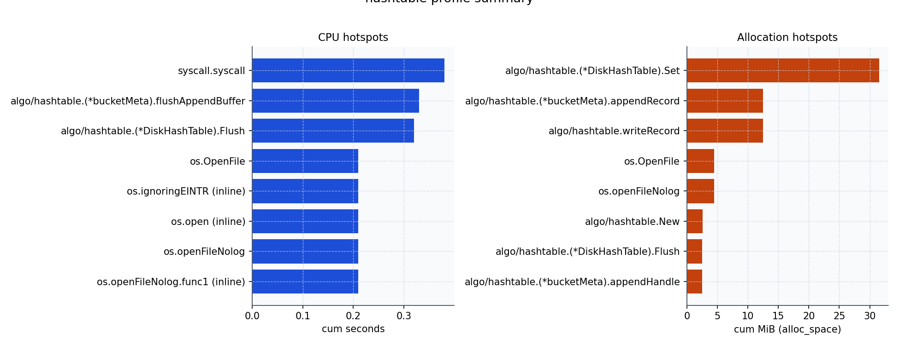

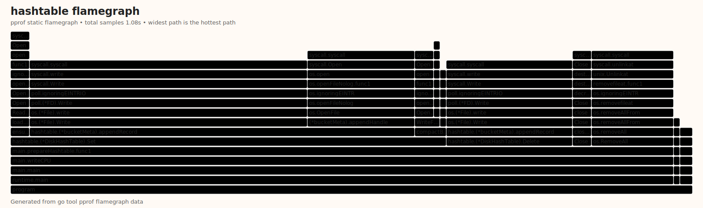

Полный flamegraph для `hashtable` показывает весь путь программы от общего блока `program` до системных вызовов записи. На нём хорошо видно, что после оптимизации открытие файла перестало доминировать, а bottleneck сместился в сам append/write-path и compaction.

<!-- TBL_PROF_HASH -->

### CPU

| function | cumulative |
|---|---|
| `syscall.syscall` | 0.38 s |
| `algo/hashtable.(*bucketMeta).flushAppendBuffer` | 0.33 s |
| `algo/hashtable.(*DiskHashTable).Flush` | 0.32 s |
| `os.OpenFile` | 0.21 s |
| `os.ignoringEINTR (inline)` | 0.21 s |

### Allocated bytes (alloc_space)

| function | cumulative |
|---|---|
| `algo/hashtable.(*DiskHashTable).Set` | 31.52 MiB |
| `algo/hashtable.(*bucketMeta).appendRecord` | 12.51 MiB |
| `algo/hashtable.writeRecord` | 12.51 MiB |
| `os.OpenFile` | 4.50 MiB |
| `os.openFileNolog` | 4.50 MiB |

<!-- /TBL_PROF_HASH -->

Профиль подтверждает ту же картину: CPU уходит в `flushAppendBuffer`, явный `Flush` и системные вызовы записи, а таблица `Allocated bytes (alloc_space)` показывает суммарное давление на аллокатор за весь прогон, а не удерживаемый heap. `syscall.syscall` всё ещё виден, потому что батч всё равно физически пишется на диск; важное отличие от исходной версии в том, что это уже не syscall на каждую отдельную запись и не артефакт `Close`.

---

## 2. Perfect hash

Индекс строится как статический двухуровневый displacement-based perfect hash: ключи сначала раскладываются по бакетам, singleton-бакеты ставятся сразу, а для остальных подбирается displacement без коллизий. По смыслу это близко к классической линии `FKS -> practical minimal/perfect hashing`, но текущая реализация сознательно выбрала простоту, а не сверхкомпактность.

<!-- TBL_CHD_BENCH -->

**Build**

| N | ms/op (±3σ) | KiB/op (±3σ) | ~ op/s |
|---|---|---|---|
| 4096 | 0.17 ± 0.04 | 472.6 ± 0.0 | 5 872 |
| 8192 | 0.42 ± 0.04 | 936.6 ± 0.0 | 2 397 |
| 16384 | 0.96 ± 0.12 | 1 864.6 ± 0.0 | 1 044 |
| 32768 | 2.16 ± 0.31 | 3 720.6 ± 0.0 | 464 |
| 65536 | 4.54 ± 1.34 | 7 432.6 ± 0.0 | 221 |
| 131072 | 8.82 ± 2.64 | 14 856.6 ± 0.0 | 113 |
| 262144 | 18.91 ± 3.15 | 29 704.6 ± 0.0 | 53 |

**Get**

| N | ns/op (±3σ) | B/op (±3σ) | ~ op/s |
|---|---|---|---|
| 4096 | 20.9 ± 1.0 | 0 ± 0.0 | 47 801 147 |
| 8192 | 21.4 ± 0.9 | 0 ± 0.0 | 46 828 537 |
| 16384 | 23.9 ± 16.1 | 0 ± 0.0 | 41 838 378 |
| 32768 | 22.8 ± 2.0 | 0 ± 0.0 | 43 931 906 |
| 65536 | 23.0 ± 2.3 | 0 ± 0.0 | 43 509 474 |
| 131072 | 23.3 ± 1.9 | 0 ± 0.0 | 42 934 118 |
| 262144 | 25.9 ± 4.7 | 0 ± 0.0 | 38 579 503 |

<!-- /TBL_CHD_BENCH -->

<!-- TBL_CHD_METRICS -->

| N | load factor | disp. bits/key | build ns/key (±3σ) | get ns/op (±3σ) |
|---|---|---|---|---|
| 1024 | 1.000 | 32.00 | 50.5 ± 21.4 | 19.7 ± 0.9 |
| 4096 | 1.000 | 32.00 | 42.8 ± 13.9 | 21.4 ± 1.7 |
| 8192 | 1.000 | 32.00 | 42.6 ± 10.0 | 21.7 ± 1.2 |
| 16384 | 1.000 | 32.00 | 42.7 ± 12.8 | 22.3 ± 2.3 |
| 32768 | 1.000 | 32.00 | 51.3 ± 10.1 | 22.7 ± 1.9 |
| 65536 | 1.000 | 32.00 | 65.0 ± 15.6 | 23.2 ± 1.6 |
| 131072 | 1.000 | 32.00 | 68.3 ± 11.1 | 23.8 ± 2.3 |
| 262144 | 1.000 | 32.00 | 79.1 ± 13.8 | 31.1 ± 9.2 |

<!-- /TBL_CHD_METRICS -->

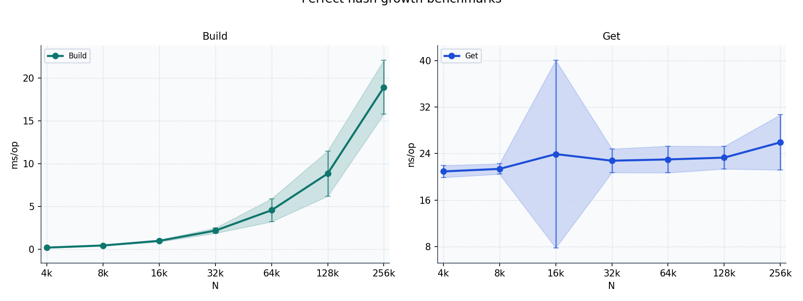

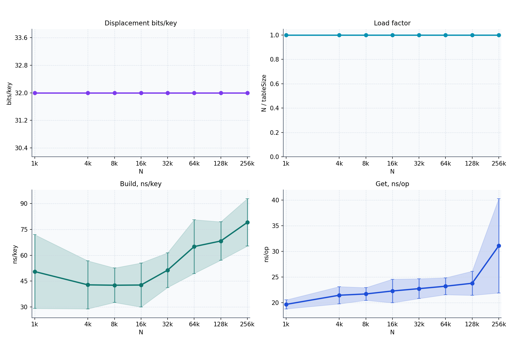

Главный плюс этого блока в том, что он ведёт себя именно так, как от static PHF и ждёшь:
- `Get` почти плоский и без аллокаций;
- `Build` растёт близко к линейно, а рост `ns/key` на больших `N` выглядит как увеличение константы из-за cache locality и дополнительных placement retries, а не как смена класса сложности;
- после оптимизации сборка больше не перевычисляет строковый хэш на каждом displacement-trial и не раздувает тысячи маленьких bucket-slice-аллокаций, поэтому `Build` стал заметно быстрее и стабильнее;
- CPU-профиль целиком вычислительный: хэширование, placement bucket-ов и чтение массивов.

Главный минус тоже читается прямо из метрик:
- `load factor = 1.0` выглядит красиво, но `32 bits/key` на displacement-массив означает, что эта версия далека от компактных MPHF из литературы, где ориентир — уже единицы бит на ключ, а не десятки;
- поэтому по времени lookup структура хороша, а по памяти — учебная, не production-grade.

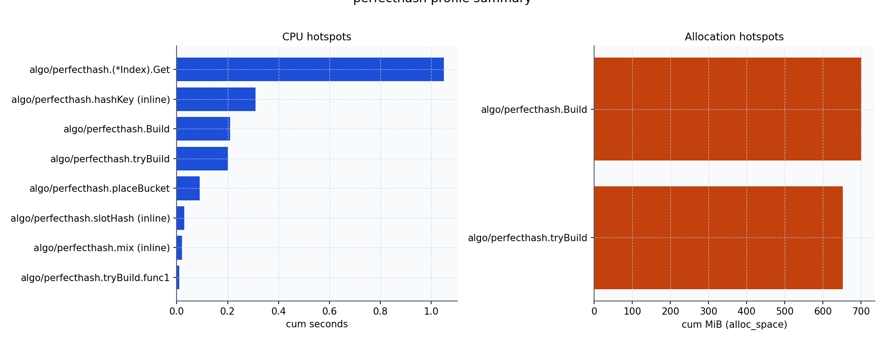

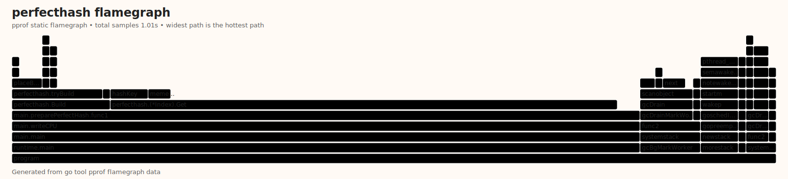

Во flamegraph для `perfecthash` основание почти целиком уходит в `Build` и `Get`, без системных вызовов записи и без I/O-шума. Это как раз ожидаемая картина для чисто вычислительной структуры: основные узкие места здесь — placement bucket-ов и повторное хэширование ключа.

<!-- TBL_PROF_CHD -->

### CPU

| function | cumulative |
|---|---|
| `algo/perfecthash.(*Index).Get` | 1.05 s |
| `algo/perfecthash.hashKey (inline)` | 0.31 s |
| `algo/perfecthash.Build` | 0.21 s |
| `algo/perfecthash.tryBuild` | 0.20 s |
| `algo/perfecthash.placeBucket` | 0.09 s |

### Allocated bytes (alloc_space)

| function | cumulative |
|---|---|
| `algo/perfecthash.Build` | 700.75 MiB |
| `algo/perfecthash.tryBuild` | 651.36 MiB |

<!-- /TBL_PROF_CHD -->

`Allocated bytes (alloc_space)` здесь тоже нужно читать аккуратно: профилирующий workload строит индекс много раз подряд, поэтому сотни MiB в таблице — это cumulative allocation pressure, а не размер одного готового индекса в памяти. Для интерпретации качества алгоритма важнее то, что профиль почти полностью состоит из `Build`, `tryBuild`, `hashKey` и `placeBucket`.

---

## 3. LSH для 3D-точек

LSH использует несколько случайных grid/hash таблиц и потом делает exact-проверку расстояния только для собранных кандидатов. Поэтому здесь очень важно не перепутать обещание структуры: LSH должен резко резать candidate set и ускорять поиск, но не обещает лучшего worst-case для exact duplicate detection. Если все точки свалятся в крупные бакеты, exact-verify снова может стать квадратичным.

<!-- TBL_LSH_BENCH -->

**Build**

| N | ms/op (±3σ) | KiB/op (±3σ) | ~ op/s |
|---|---|---|---|
| 1000 | 0.56 ± 0.06 | 653.0 ± 0.3 | 1 775 |
| 2000 | 1.23 ± 0.18 | 1 399.5 ± 11.6 | 815 |
| 4000 | 2.68 ± 0.23 | 2 805.4 ± 24.5 | 373 |
| 8000 | 5.64 ± 0.51 | 5 659.6 ± 66.8 | 177 |
| 12000 | 10.27 ± 4.57 | 10 457.4 ± 90.9 | 97 |
| 16000 | 11.88 ± 0.97 | 11 399.9 ± 156.1 | 84 |
| 24000 | 24.56 ± 17.52 | 21 752.5 ± 618.2 | 41 |
| 32000 | 32.84 ± 8.83 | 22 858.6 ± 518.6 | 30 |

**Add**

| N | ns/op (±3σ) | B/op (±3σ) | ~ op/s |
|---|---|---|---|
| 1000 | 1 838 ± 589.5 | 1 334 ± 178.8 | 543 936 |
| 2000 | 1 643 ± 308.9 | 1 046 ± 100.2 | 608 550 |
| 4000 | 1 760 ± 122.4 | 1 262 ± 111.0 | 568 053 |
| 8000 | 1 758 ± 133.6 | 1 227 ± 186.8 | 568 861 |
| 12000 | 1 841 ± 616.2 | 998 ± 37.5 | 543 257 |
| 16000 | 1 785 ± 308.8 | 1 191 ± 174.0 | 560 224 |
| 24000 | 1 916 ± 441.0 | 1 195 ± 348.2 | 521 812 |
| 32000 | 1 799 ± 196.3 | 1 084 ± 171.5 | 555 973 |

**Find**

| N | ms/op (±3σ) | KiB/op (±3σ) | ~ op/s |
|---|---|---|---|
| 1000 | 0.10 ± 0.01 | 16.0 ± 0.0 | 9 999 |
| 2000 | 0.25 ± 0.02 | 32.0 ± 0.0 | 4 040 |
| 4000 | 0.48 ± 0.05 | 64.0 ± 0.0 | 2 074 |
| 8000 | 1.16 ± 0.28 | 128.0 ± 0.0 | 861 |
| 12000 | 2.33 ± 2.34 | 192.0 ± 0.0 | 429 |
| 16000 | 2.53 ± 0.82 | 256.0 ± 0.0 | 396 |
| 24000 | 4.43 ± 0.85 | 376.0 ± 0.0 | 226 |
| 32000 | 7.11 ± 0.88 | 504.0 ± 0.0 | 141 |

**Naive**

| N | ms/op (±3σ) | KiB/op (±3σ) | ~ op/s |
|---|---|---|---|
| 1000 | 0.50 ± 0.30 | 4.0 ± 0.0 | 2 014 |
| 2000 | 1.89 ± 0.41 | 8.0 ± 0.0 | 528 |
| 4000 | 7.40 ± 0.20 | 16.0 ± 0.0 | 135 |
| 8000 | 29.19 ± 0.54 | 49.2 ± 0.0 | 34 |
| 12000 | 65.70 ± 1.23 | 77.2 ± 0.0 | 15 |
| 16000 | 116.59 ± 2.44 | 117.2 ± 0.0 | 9 |
| 24000 | 262.33 ± 6.51 | 173.2 ± 0.0 | 4 |
| 32000 | 480.62 ± 90.93 | 253.2 ± 0.0 | 2 |

<!-- /TBL_LSH_BENCH -->

<!-- TBL_LSH_METRICS -->

| N | recall (±3σ) | precision (±3σ) | cand/all (±3σ) | build ms (±3σ) | add ns/op (±3σ) | find ms (±3σ) | naive ms (±3σ) | speedup (±3σ) |
|---|---|---|---|---|---|---|---|---|
| 1000 | 1.000 ± 0.000 | 1.000 ± 0.000 | 0.819% ± 0.789% | 0.53 ± 0.19 | 765.8 ± 610.8 | 0.12 ± 0.02 | 0.46 ± 0.02 | 3.77 ± 0.43 |
| 2000 | 1.000 ± 0.000 | 1.000 ± 0.000 | 0.470% ± 0.513% | 1.05 ± 0.13 | 643.6 ± 249.5 | 0.28 ± 0.09 | 1.83 ± 0.10 | 6.72 ± 1.88 |
| 4000 | 1.000 ± 0.000 | 1.000 ± 0.000 | 0.275% ± 0.325% | 2.32 ± 0.48 | 636.0 ± 246.3 | 0.56 ± 0.10 | 7.25 ± 0.08 | 13.05 ± 2.36 |
| 8000 | 1.000 ± 0.000 | 1.000 ± 0.000 | 0.157% ± 0.202% | 5.52 ± 2.22 | 671.7 ± 313.6 | 1.63 ± 0.44 | 29.17 ± 0.52 | 18.05 ± 4.56 |
| 12000 | 1.000 ± 0.000 | 1.000 ± 0.000 | 0.115% ± 0.153% | 9.99 ± 2.10 | 802.8 ± 337.2 | 4.09 ± 1.28 | 65.92 ± 1.05 | 16.28 ± 5.36 |
| 16000 | 1.000 ± 0.000 | 1.000 ± 0.000 | 0.089% ± 0.123% | 14.88 ± 14.31 | 1033.9 ± 590.9 | 6.16 ± 4.05 | 139.58 ± 70.75 | 23.00 ± 8.28 |
| 24000 | 1.000 ± 0.000 | 1.000 ± 0.000 | 0.065% ± 0.092% | 26.35 ± 9.97 | 1033.2 ± 875.4 | 10.40 ± 3.32 | 284.69 ± 73.37 | 27.73 ± 14.58 |
| 32000 | 1.000 ± 0.000 | 1.000 ± 0.000 | 0.051% ± 0.074% | 30.06 ± 5.08 | 901.9 ± 357.3 | 14.75 ± 4.13 | 467.12 ± 6.04 | 31.89 ± 8.87 |

<!-- /TBL_LSH_METRICS -->

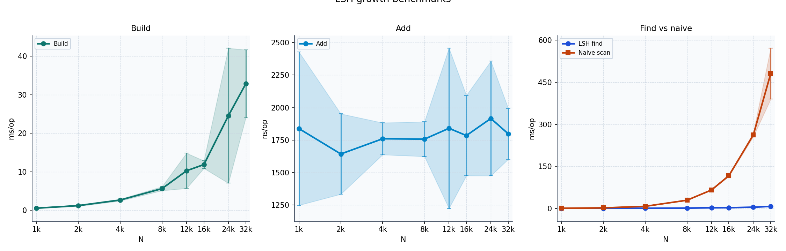

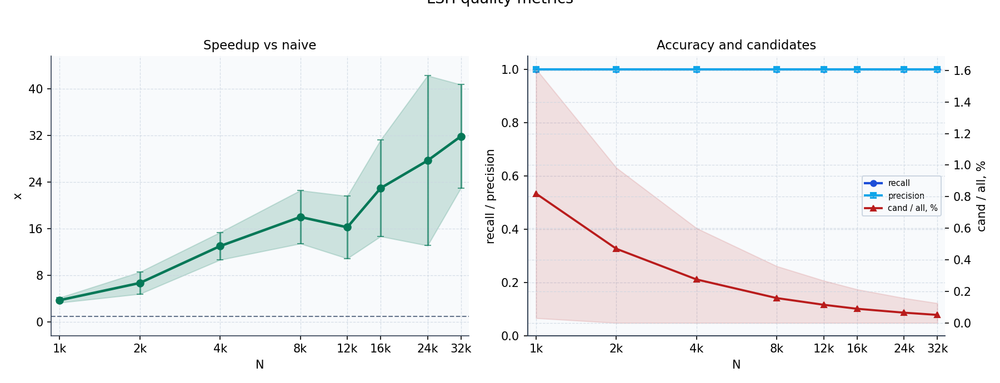

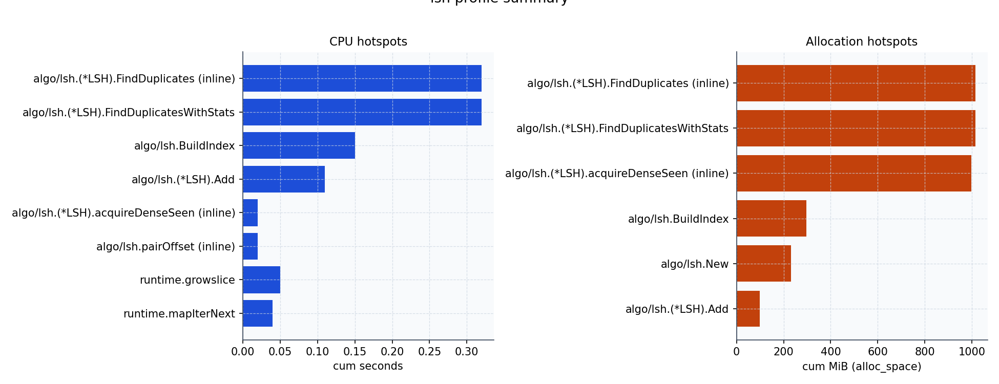

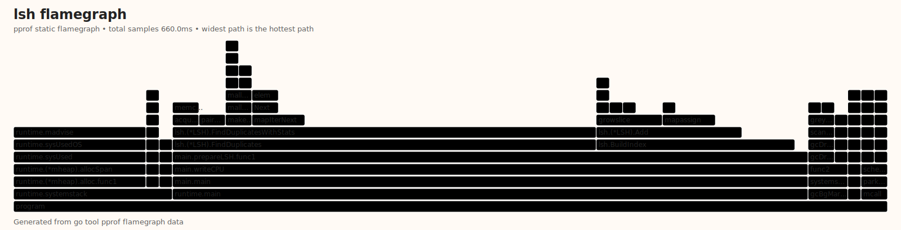

Статический flamegraph ниже — это полный CPU-профиль программы в flame-style формате: нижний блок `program` занимает 100% времени профиля, а выше остаются все ветви `runtime`, пользовательских функций и системных вызовов. Чем шире прямоугольник, тем больше cumulative time у соответствующего пути.

<!-- TBL_PROF_LSH -->

### CPU

| function | cumulative |
|---|---|
| `algo/lsh.(*LSH).FindDuplicates (inline)` | 0.32 s |
| `algo/lsh.(*LSH).FindDuplicatesWithStats` | 0.32 s |
| `algo/lsh.BuildIndex` | 0.15 s |
| `algo/lsh.(*LSH).Add` | 0.11 s |
| `algo/lsh.(*LSH).acquireDenseSeen (inline)` | 0.02 s |

### Allocated bytes (alloc_space)

| function | cumulative |
|---|---|
| `algo/lsh.(*LSH).FindDuplicates (inline)` | 1015.38 MiB |
| `algo/lsh.(*LSH).FindDuplicatesWithStats` | 1015.38 MiB |
| `algo/lsh.(*LSH).acquireDenseSeen (inline)` | 996.94 MiB |
| `algo/lsh.BuildIndex` | 296.42 MiB |
| `algo/lsh.New` | 230.94 MiB |

<!-- /TBL_PROF_LSH -->

Профиль это подтверждает: время сидит в `FindDuplicatesWithStats`, `Add` и map-операциях для bucket-ов и `seen`. Таблица allocation pressure опять же не про resident memory, а про цену постоянного создания candidate set и сопутствующих map/slice-структур во время прогона.
