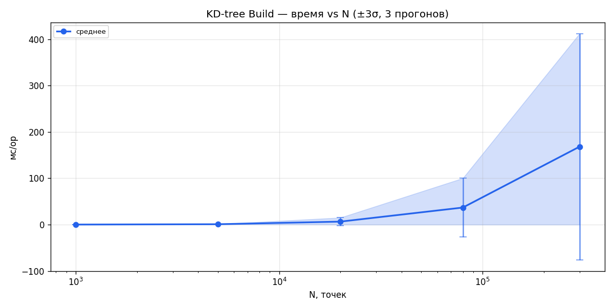
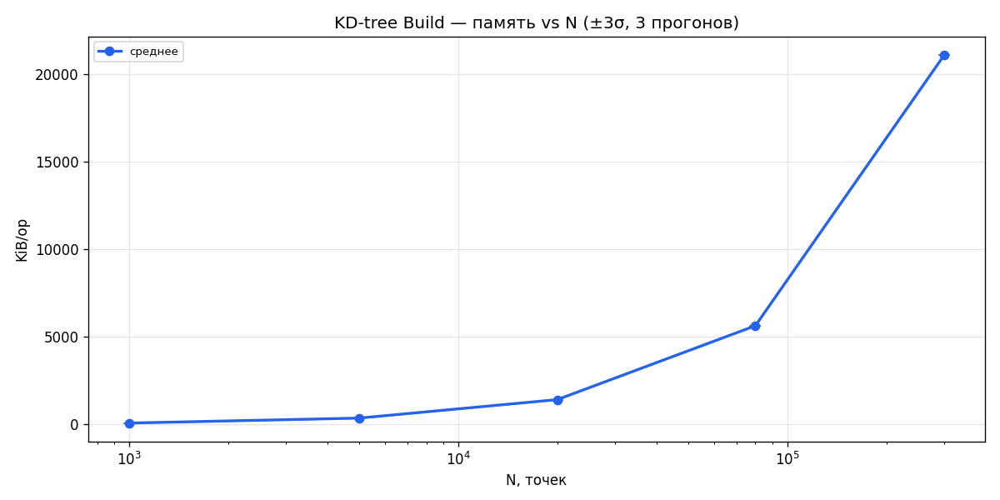
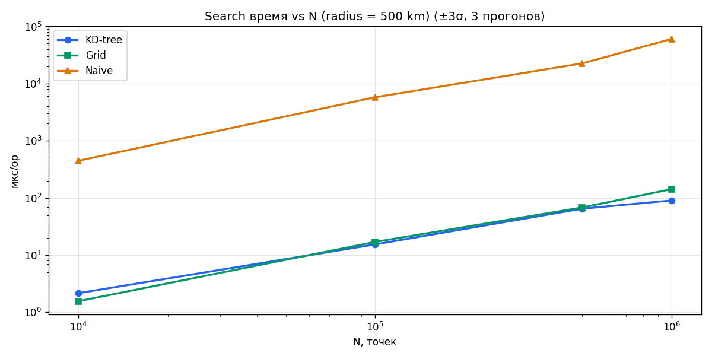
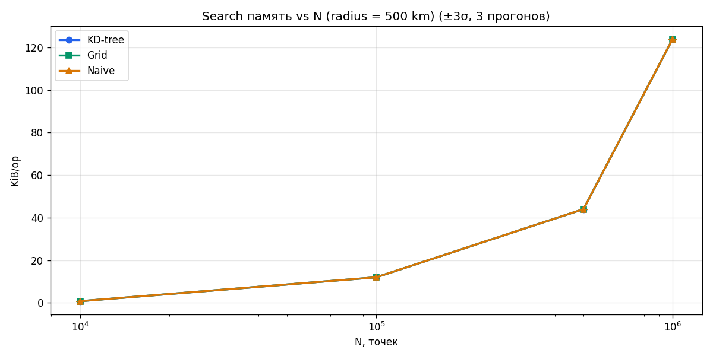
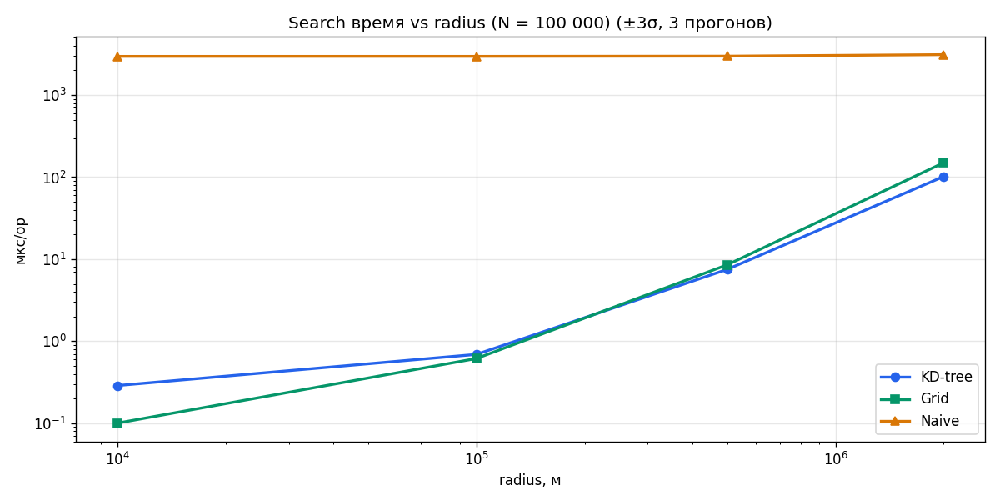

# Лабораторная работа 2: геопоиск по Lat/Lng

Реализованы два пространственных индекса для хранения и поиска объектов по географическим координатам:

- **KD-tree** — сбалансированное k-d дерево. Build O(n log n) через quickselect (медиана без полной сортировки), Search O(log n + k).
- **Grid index** — равномерная сетка ячеек. Add O(1), Search O(cells + k) — при правильно подобранном размере ячейки ≈ O(k).
- **Naive** — линейный скан O(n), базовый ориентир.

Расстояния вычисляются по формуле Гаверсинуса.

---

## Рис. 1–2. KD-tree Build: время и память vs N

## Рис. 3–4. Search: время и память vs N (radius = 500 km)

## Рис. 5. Search: время vs radius (N = 100 000)

---

## Таблица 1. KD-tree Build (quickselect)

| N | мс/op | B/op | ~ op/с |
|---|-------|------|--------|
| 1 000 | 0.18 ± 0.12 | 72 580 | 5 462 |
| 5 000 | 0.87 ± 0.03 | 362 881 | 1 150 |
| 20 000 | 6.48 ± 2.83 | 1 443 336 | 154 |
| 80 000 | 36.87 ± 21.10 | 5 765 120 | 27 |
| 300 000 | 168.35 ± 81.41 | 21 604 267 | 6 |

## Таблица 2. Search, radius = 500 km (±3σ)

| N | KD-tree, мкс | Grid, мкс | Naive, мкс |
|---|-------------|-----------|------------|
| 10 000 | 2.2 ± 1.3 | 1.6 ± 0.8 | 446.9 ± 212.3 |
| 100 000 | 15.4 ± 9.8 | 17.0 ± 5.6 | 5 761.2 ± 4 051.8 |
| 500 000 | 65.0 ± 48.6 | 68.2 ± 27.5 | 22 574.1 ± 8 828.2 |
| 1 000 000 | 90.4 ± 44.1 | 142.6 ± 81.1 | 60 380.3 ± 28 415.6 |

## Таблица 3. Радиус vs время поиска (N = 100 000)

| Радиус | KD, мкс | Grid, мкс | Naive, мс | KD/Naive |
|--------|---------|-----------|-----------|----------|
| 10 km | 0.3 ± 0.0 | 0.1 ± 0.0 | 3.0 ± 0.0 | 10 282× |
| 100 km | 0.7 ± 0.0 | 0.6 ± 0.0 | 3.0 ± 0.0 | 4 288× |
| 500 km | 7.5 ± 0.1 | 8.6 ± 0.1 | 3.0 ± 0.0 | 396× |
| 2 000 km | 101.8 ± 1.9 | 149.9 ± 0.3 | 3.1 ± 0.1 | 31× |

---

**Бутылочное горлышко**: при большом радиусе (2000 km) каждый запрос аллоцирует ~200 KB и делает ~14 промежуточных аллокаций из-за роста slice методом удвоения (1→2→4→...→4096 элементов). Это O(k log k) суммарно выделенной памяти, где k — размер результата. Grid при таком радиусе проходит тысячи ячеек и проигрывает KD-tree вдвое.

---
