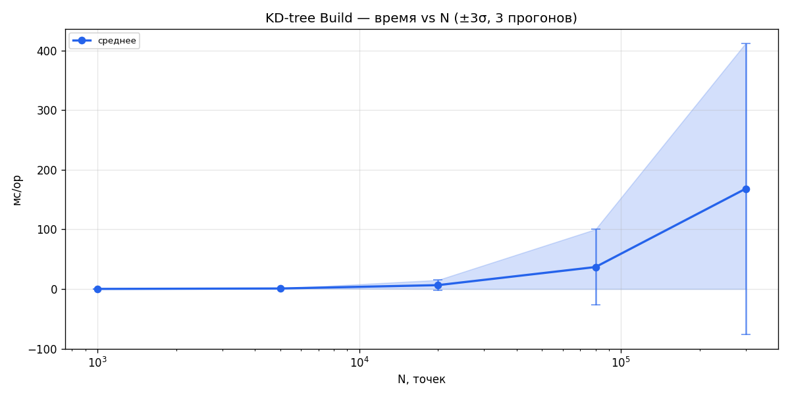
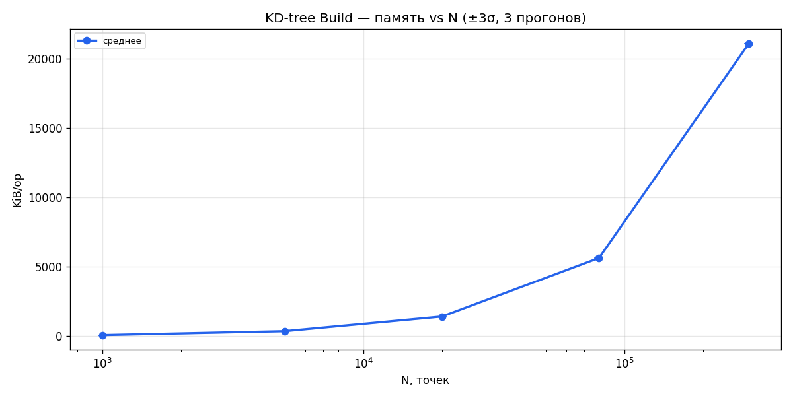
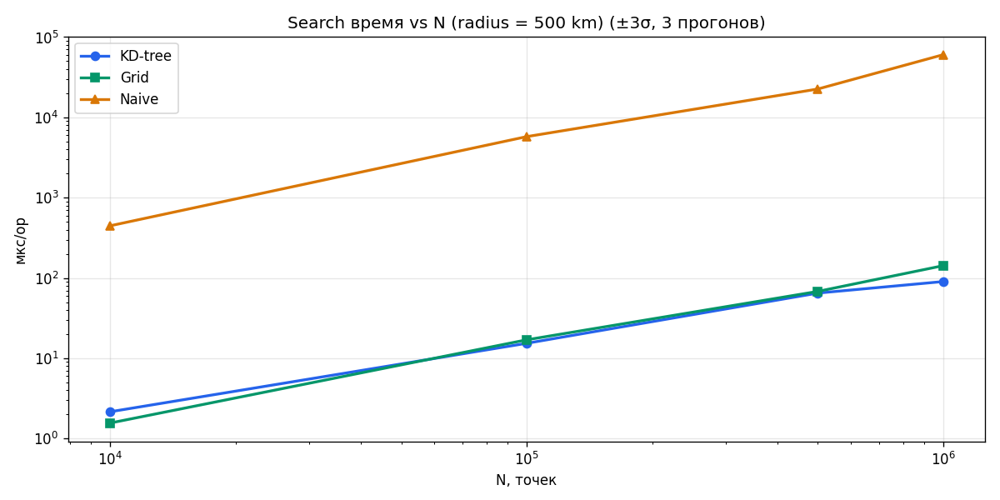
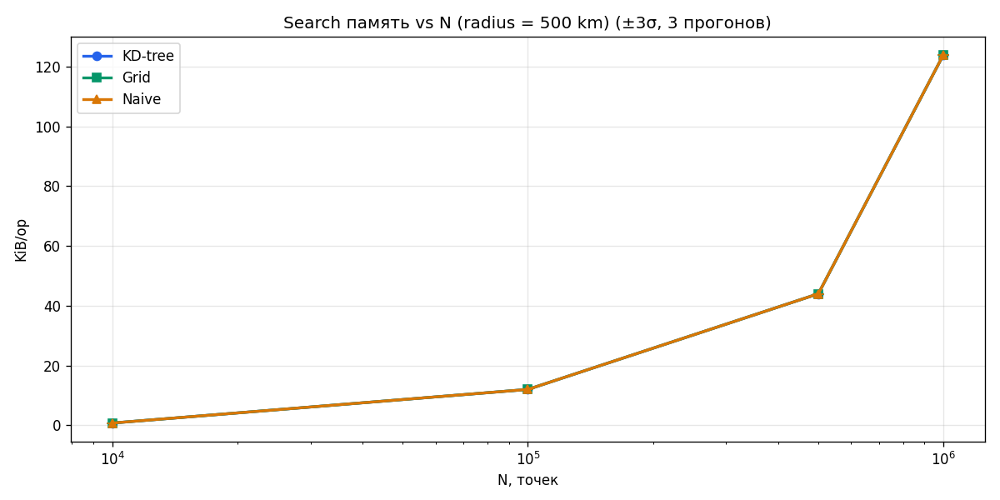
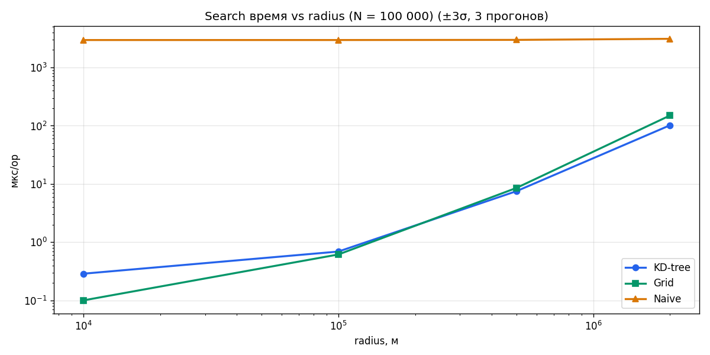

# Лабораторная работа 2: геопоиск по Lat/Lng

## Состав

| Метод | Идея | Ожидаемо |
|---|---|---|
| `KD-tree` | spatial tree по координатам | build `O(n log n)`, search `O(log n + k)` |
| `Grid` | равномерная сетка ячеек | search зависит от числа ячеек и `k` |
| `Naive` | полный scan | search `O(n)` |
| Distance | Haversine | расстояние по сфере |

## Sanity-check графиков

| График | Ожидание | Факт | Статус |
|---|---|---|---|
| KD build time | рост быстрее линейного или около `n log n` | `0.18 -> 168.35 ms` | OK, шум на больших `N` |
| KD build memory | почти линейно | `72 KB -> 21.6 MB` | OK |
| Search vs `N` | Naive линейно, KD/Grid сильно ниже | `60.38 ms` vs `90.4/142.6 us` на `1M` | OK |
| Search vs radius | KD/Grid растут с радиусом | `0.3 us -> 101.8 us` для KD | OK |
| Grid vs KD | Grid хуже на большом радиусе | `149.9 us` vs `101.8 us` при `2000 km` | OK |

## Графики

## KD-tree Build

| N | мс/op | B/op | ~ op/с |
|---|-------|------|--------|
| 1 000 | 0.18 ± 0.12 | 72 580 | 5 462 |
| 5 000 | 0.87 ± 0.03 | 362 881 | 1 150 |
| 20 000 | 6.48 ± 2.83 | 1 443 336 | 154 |
| 80 000 | 36.87 ± 21.10 | 5 765 120 | 27 |
| 300 000 | 168.35 ± 81.41 | 21 604 267 | 6 |

## Search, radius = 500 km

| N | KD-tree, мкс | Grid, мкс | Naive, мкс |
|---|---:|---:|---:|
| 10 000 | 2.2 ± 1.3 | 1.6 ± 0.8 | 446.9 ± 212.3 |
| 100 000 | 15.4 ± 9.8 | 17.0 ± 5.6 | 5 761.2 ± 4 051.8 |
| 500 000 | 65.0 ± 48.6 | 68.2 ± 27.5 | 22 574.1 ± 8 828.2 |
| 1 000 000 | 90.4 ± 44.1 | 142.6 ± 81.1 | 60 380.3 ± 28 415.6 |

## Radius vs Search Time, N = 100 000

| Радиус | KD, мкс | Grid, мкс | Naive, мс | KD/Naive |
|---|---:|---:|---:|---:|
| 10 km | 0.3 ± 0.0 | 0.1 ± 0.0 | 3.0 ± 0.0 | 10 282× |
| 100 km | 0.7 ± 0.0 | 0.6 ± 0.0 | 3.0 ± 0.0 | 4 288× |
| 500 km | 7.5 ± 0.1 | 8.6 ± 0.1 | 3.0 ± 0.0 | 396× |
| 2 000 km | 101.8 ± 1.9 | 149.9 ± 0.3 | 3.1 ± 0.1 | 31× |
