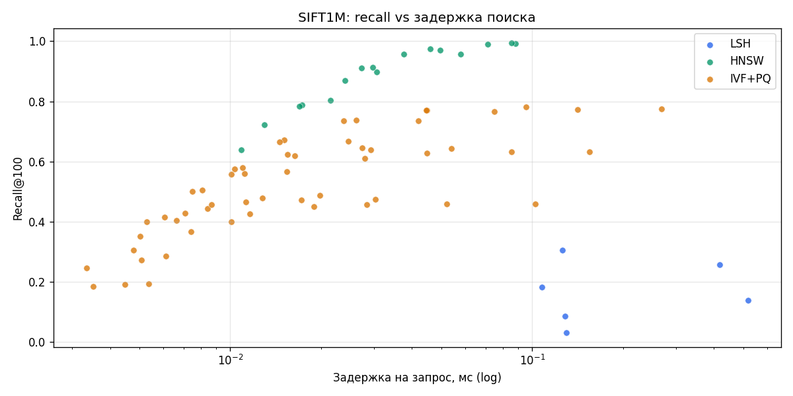
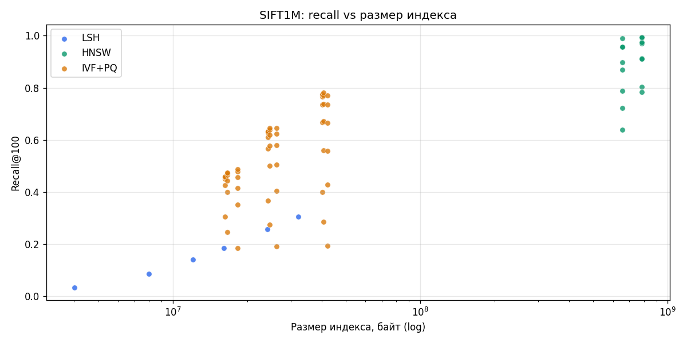
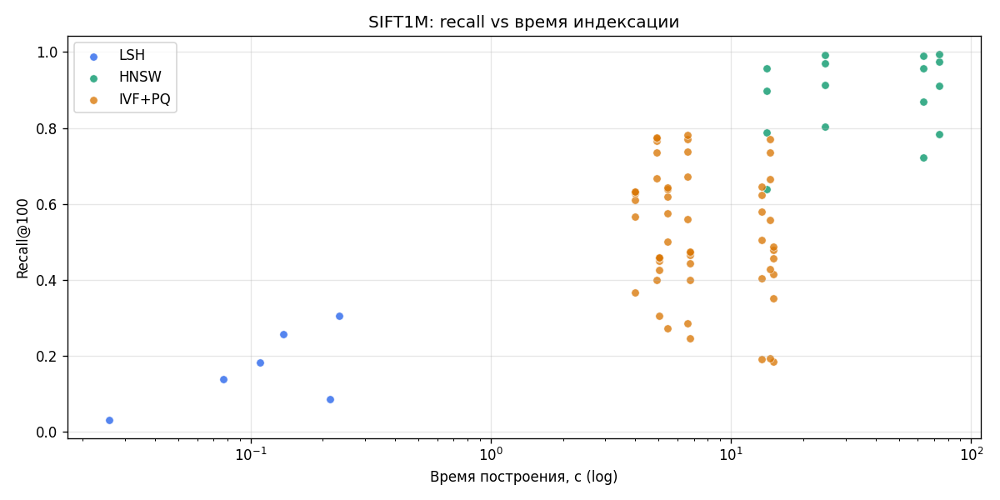
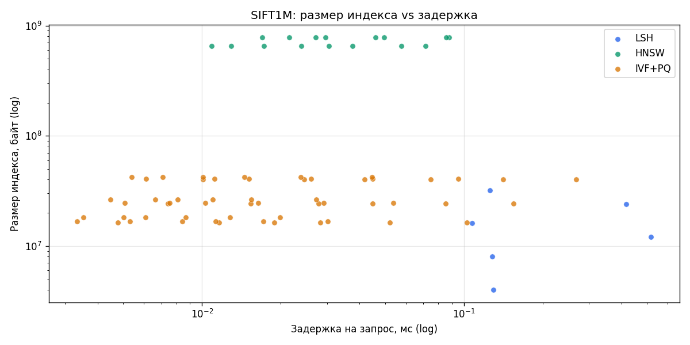
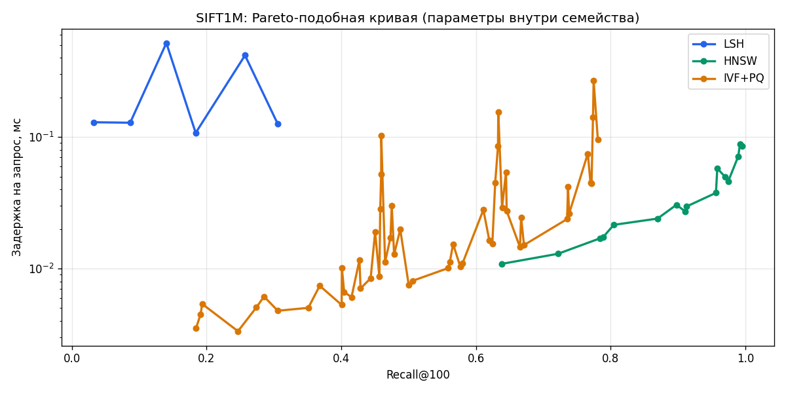
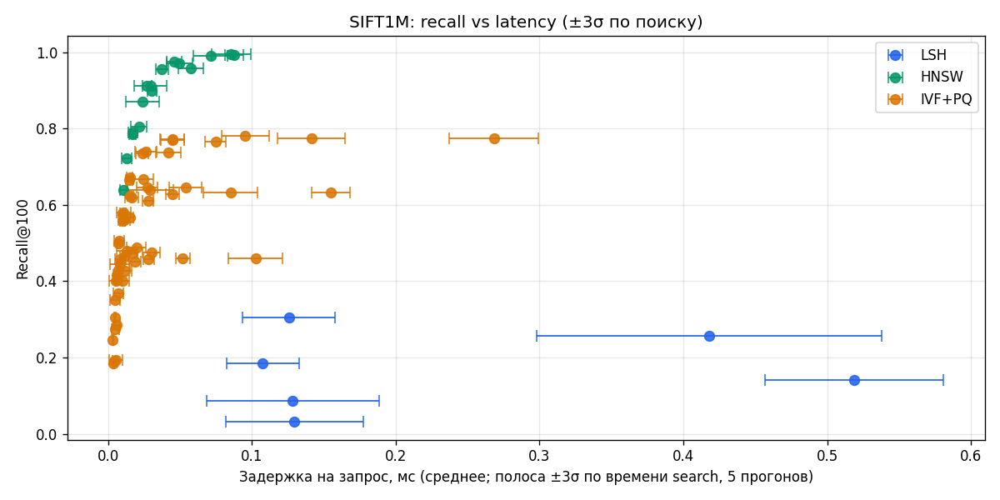

# Лабораторная работа 3: ANN на SIFT1M (Faiss)

**Датасет:** SIFT1M из ann-benchmarks (`train` 1 000 000×128, `test` 10 000 запросов). В HDF5 уже есть **точные** топ-100 соседей по L2 (`neighbors`) — это **ground truth** для recall@100 (пересчёт kNN по всей базе не делаем).

**Библиотека:** [Faiss](https://github.com/facebookresearch/faiss) — `IndexLSH`, `IndexHNSWFlat`, `IndexIVFPQ`.

**Метрика:** средний **recall@100** = доля пересечения найденных id с эталоном, усреднённая по 10 000 запросам.

Ниже приведены результаты полного прогона на SIFT1M. Основные оси сравнения: **recall@100**, задержка запроса, время построения и размер индекса. Для времени поиска в таблицах и на рис. 6 показаны средние значения и `±3σ`.

---

## Рис. 1. Recall@100 vs задержка поиска

## Рис. 2. Recall@100 vs размер индекса

## Рис. 3. Recall@100 vs время построения

## Рис. 4. Размер индекса vs задержка

## Рис. 5. Кривые recall–latency по семействам индексов

## Рис. 6. Recall vs задержка с **±3σ** по времени поиска (линейная ось X)

---

## Таблицы

Сначала — краткая сводка по лучшим конфигурациям каждого семейства, ниже — полная линейка LSH как компактного baseline.

| Семейство | Лучшая конфигурация по recall | Recall@100 | Поиск, мс/q (±3σ) | Построение, с | Размер, МБ |
|---|---|---:|---:|---:|---:|
| `LSH` | `LSH nbits=256` | 0.3056 | 0.1257 ± 0.0323 | 0.23 | 32.13 |
| `HNSW` | `HNSW M=32 efc=200 efs=256` | 0.9946 | 0.0856 ± 0.0135 | 73.71 | 784.13 |
| `IVF+PQ` | `IVFPQ nlist=1024 m=32 nprobe=64` | 0.7809 | 0.0954 ± 0.0166 | 6.61 | 40.66 |

### Таблица 1. LSH (текущий полный прогон SIFT1M)

| Конфигурация | Recall@100 | Построение, с | Поиск, мс/q (±3σ) | Размер, МБ |
|---|---:|---:|---:|---:|
| `LSH nbits=32` | 0.0326 | 0.03 | 0.1296 ± 0.0478 | 4.02 |
| `LSH nbits=64` | 0.0865 | 0.21 | 0.1285 ± 0.0599 | 8.03 |
| `LSH nbits=96` | 0.1402 | 0.08 | 0.5186 ± 0.0620 | 12.05 |
| `LSH nbits=128` | 0.1838 | 0.11 | 0.1076 ± 0.0253 | 16.07 |
| `LSH nbits=192` | 0.2570 | 0.14 | 0.4180 ± 0.1198 | 24.10 |
| `LSH nbits=256` | 0.3056 | 0.23 | 0.1257 ± 0.0323 | 32.13 |
