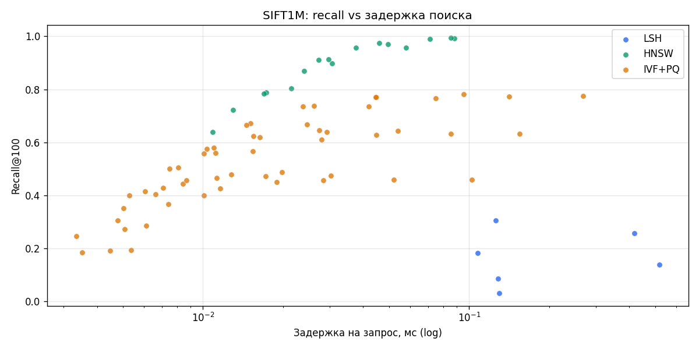
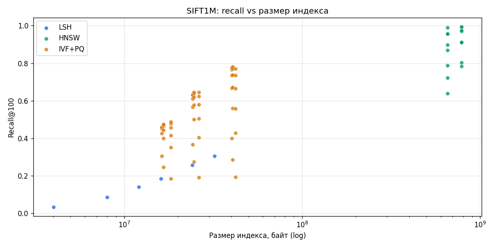
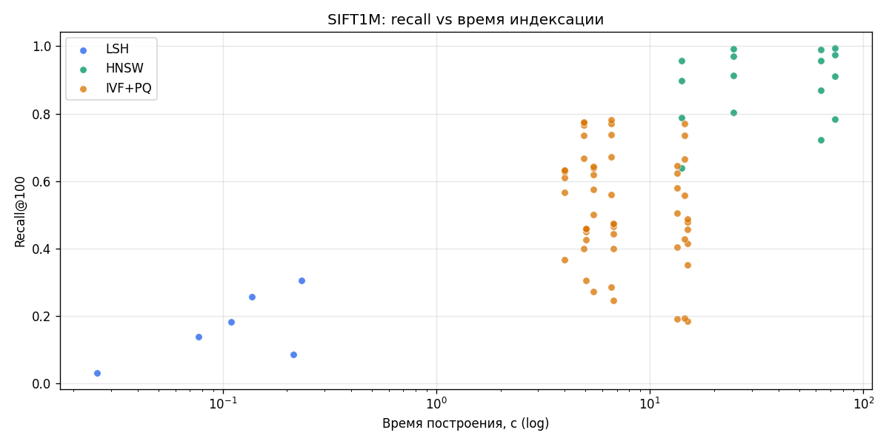
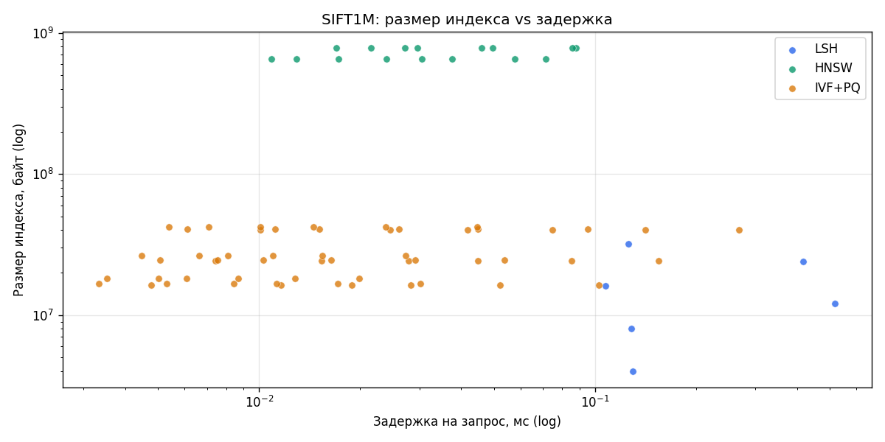
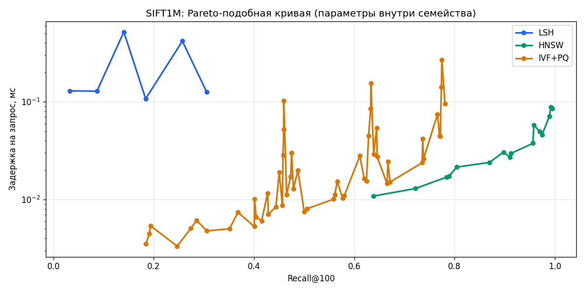
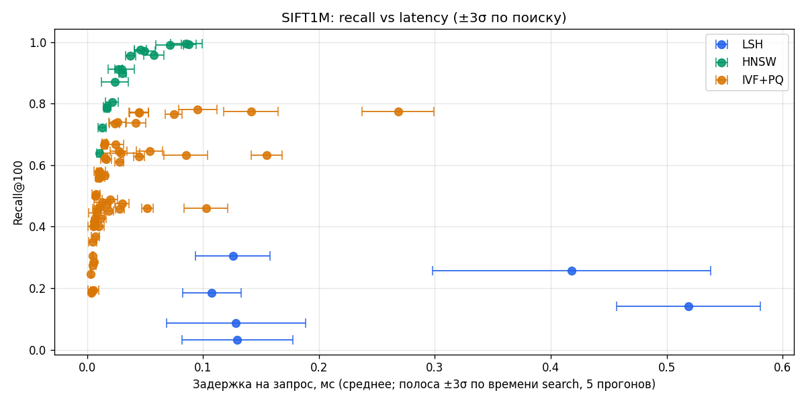

# Лабораторная работа 3: ANN на SIFT1M

## Состав

| Часть | Значение |
|---|---|
| Dataset | SIFT1M, `1_000_000 x 128` base, `10_000` queries |
| Ground truth | exact top-100 из HDF5 |
| Metric | `recall@100` |
| Library | Faiss |
| Indexes | `IndexLSH`, `IndexHNSWFlat`, `IndexIVFPQ` |
| Search stats | mean ± `3σ` |

## Sanity-check графиков

| График | Ожидание | Факт | Статус |
|---|---|---|---|
| LSH recall vs `nbits` | recall и size растут | `0.0326 -> 0.3056`, `4.02 -> 32.13 MB` | OK |
| LSH latency vs `nbits` | не обязана быть строго монотонной | скачки на `96/192 bits` | шум/особенность Faiss |
| HNSW recall vs `efSearch` | recall и latency растут | `0.6385 -> 0.9946` | OK |
| HNSW build/size | дороже остальных | `73.71 s`, `784.13 MB` | OK |
| IVFPQ recall vs `nprobe` | recall и latency растут | до `0.7809`, `0.0954 ms/q` | OK |
| Recall/size trade-off | IVFPQ компактнее HNSW | `40.66 MB` vs `784.13 MB` | OK |

## Графики

## Best by Recall

| Семейство | Конфигурация | Recall@100 | Поиск, мс/q (±3σ) | Build, s | Size, MB |
|---|---|---:|---:|---:|---:|
| `LSH` | `LSH nbits=256` | 0.3056 | 0.1257 ± 0.0323 | 0.23 | 32.13 |
| `HNSW` | `HNSW M=32 efc=200 efs=256` | 0.9946 | 0.0856 ± 0.0135 | 73.71 | 784.13 |
| `IVFPQ` | `IVFPQ nlist=1024 m=32 nprobe=64` | 0.7809 | 0.0954 ± 0.0166 | 6.61 | 40.66 |

## Best Compromise

| Конфигурация | Recall@100 | Поиск, мс/q (±3σ) | Build, s | Size, MB |
|---|---:|---:|---:|---:|
| `IVFPQ nlist=1024 m=16 nprobe=8` | 0.5767 | 0.0103 ± 0.0019 | 5.42 | 24.66 |

## LSH

| Конфигурация | Recall@100 | Build, s | Поиск, мс/q (±3σ) | Size, MB |
|---|---:|---:|---:|---:|
| `LSH nbits=32` | 0.0326 | 0.03 | 0.1296 ± 0.0478 | 4.02 |
| `LSH nbits=64` | 0.0865 | 0.21 | 0.1285 ± 0.0599 | 8.03 |
| `LSH nbits=96` | 0.1402 | 0.08 | 0.5186 ± 0.0620 | 12.05 |
| `LSH nbits=128` | 0.1838 | 0.11 | 0.1076 ± 0.0253 | 16.07 |
| `LSH nbits=192` | 0.2570 | 0.14 | 0.4180 ± 0.1198 | 24.10 |
| `LSH nbits=256` | 0.3056 | 0.23 | 0.1257 ± 0.0323 | 32.13 |

## HNSW

| Конфигурация | Recall@100 | Build, s | Поиск, мс/q (±3σ) | Size, MB |
|---|---:|---:|---:|---:|
| `HNSW M=16 efc=40 efs=32` | 0.6385 | 14.12 | 0.0109 ± 0.0027 | 656.26 |
| `HNSW M=16 efc=40 efs=64` | 0.7885 | 14.12 | 0.0173 ± 0.0031 | 656.26 |
| `HNSW M=16 efc=40 efs=128` | 0.8976 | 14.12 | 0.0305 ± 0.0031 | 656.26 |
| `HNSW M=16 efc=40 efs=256` | 0.9582 | 14.12 | 0.0578 ± 0.0088 | 656.26 |
| `HNSW M=16 efc=200 efs=32` | 0.7218 | 63.18 | 0.0130 ± 0.0033 | 656.26 |
| `HNSW M=16 efc=200 efs=64` | 0.8696 | 63.18 | 0.0240 ± 0.0117 | 656.26 |
| `HNSW M=16 efc=200 efs=128` | 0.9562 | 63.18 | 0.0376 ± 0.0041 | 656.26 |
| `HNSW M=16 efc=200 efs=256` | 0.9893 | 63.18 | 0.0712 ± 0.0118 | 656.26 |
| `HNSW M=32 efc=40 efs=32` | 0.8045 | 24.64 | 0.0215 ± 0.0057 | 784.13 |
| `HNSW M=32 efc=40 efs=64` | 0.9125 | 24.64 | 0.0296 ± 0.0115 | 784.13 |
| `HNSW M=32 efc=40 efs=128` | 0.9699 | 24.64 | 0.0497 ± 0.0090 | 784.13 |
| `HNSW M=32 efc=40 efs=256` | 0.9919 | 24.64 | 0.0879 ± 0.0063 | 784.13 |
| `HNSW M=32 efc=200 efs=32` | 0.7842 | 73.71 | 0.0170 ± 0.0022 | 784.13 |
| `HNSW M=32 efc=200 efs=64` | 0.9108 | 73.71 | 0.0271 ± 0.0032 | 784.13 |
| `HNSW M=32 efc=200 efs=128` | 0.9745 | 73.71 | 0.0460 ± 0.0051 | 784.13 |
| `HNSW M=32 efc=200 efs=256` | 0.9946 | 73.71 | 0.0856 ± 0.0135 | 784.13 |

## IVFPQ: Best per Group

| Конфигурация | Recall@100 | Build, s | Поиск, мс/q (±3σ) | Size, MB |
|---|---:|---:|---:|---:|
| `IVFPQ nlist=256 m=8 nprobe=64` | 0.4593 | 5.01 | 0.1026 ± 0.0189 | 16.26 |
| `IVFPQ nlist=256 m=16 nprobe=64` | 0.6331 | 3.98 | 0.1548 ± 0.0133 | 24.26 |
| `IVFPQ nlist=256 m=32 nprobe=64` | 0.7746 | 4.92 | 0.2683 ± 0.0309 | 40.26 |
| `IVFPQ nlist=1024 m=8 nprobe=64` | 0.4749 | 6.76 | 0.0302 ± 0.0059 | 16.66 |
| `IVFPQ nlist=1024 m=16 nprobe=64` | 0.6445 | 5.42 | 0.0539 ± 0.0113 | 24.66 |
| `IVFPQ nlist=1024 m=32 nprobe=64` | 0.7809 | 6.61 | 0.0954 ± 0.0166 | 40.66 |
| `IVFPQ nlist=4096 m=8 nprobe=64` | 0.4875 | 14.99 | 0.0198 ± 0.0066 | 18.26 |
| `IVFPQ nlist=4096 m=16 nprobe=64` | 0.6455 | 13.40 | 0.0274 ± 0.0073 | 26.26 |
| `IVFPQ nlist=4096 m=32 nprobe=64` | 0.7715 | 14.55 | 0.0446 ± 0.0087 | 42.26 |
