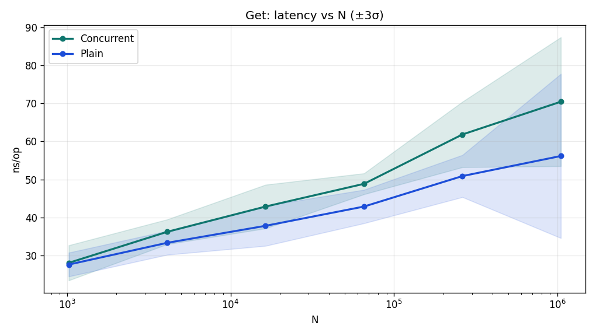
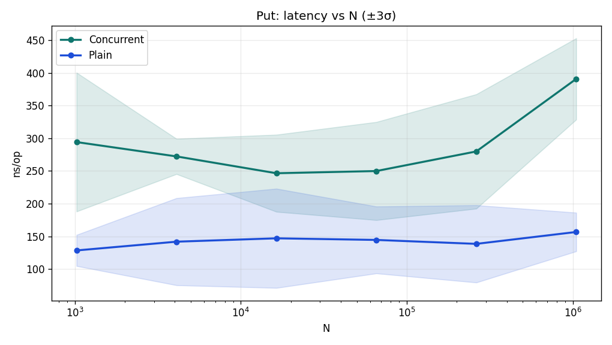
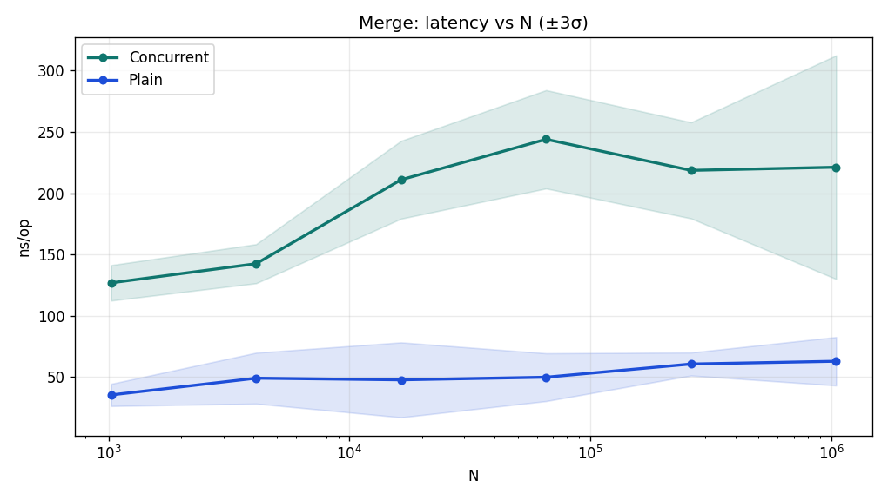
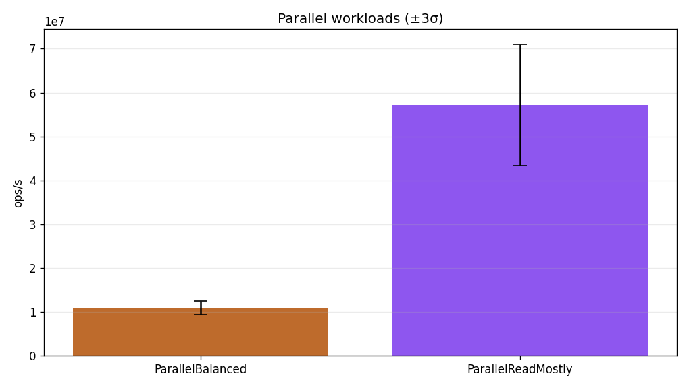

# Лабораторная работа 4: concurrent hash-map

Реализация — **thread-safe hash-table с закрытой адресацией** и weakly-consistent iterator по мотивам `ConcurrentHashMap`: чтения не берут mutex, а читают **immutable snapshot бакета** через `atomic.Pointer`; запись блокирует только один бакет и публикует новую версию chain-а одной атомарной записью.

Структура поддерживает:

- `Put(key, value)`
- `Get(key) -> (value, ok)`
- `Size()`
- `Clear()`
- `Merge(key, value, merger)`
- `Iterator()`

Сравнение ведётся с однопоточной baseline-версией на той же схеме бакетов и цепочек, но без синхронизации.

---

## Как устроена реализация

- **Closed addressing**: каждая корзина хранит маленький slice `entry`.
- **Reads are almost never blocking**: `Get` только читает текущую таблицу и snapshot выбранного бакета через атомики.
- **Writes are local**: `Put`/`Merge` копируют только одну chain-цепочку под lock конкретного бакета.
- **Resize**: при load factor > `8.0` выполняется полная rehash-перестройка под глобальным `resizeMu`, при этом читатели продолжают видеть старую или новую таблицу без падений.
- **Iterator**: weakly consistent, как у JDK `ConcurrentHashMap`; он не стопорит записи и не обещает идеально глобальный snapshot.

---

## Результаты

Корректность проверялась тестами и проверкой на data races. Ниже важны прежде всего latency-кривые, throughput под параллельной нагрузкой и профиль read/write path.

### Графики

### Краткая сводка

| Операция (`N=1_048_576`) | Concurrent | Plain | Overhead |
|---|---:|---:|---:|
| `Get` | 70.44 ns/op | 56.16 ns/op | 1.25x |
| `Put` | 390.94 ns/op | 156.62 ns/op | 2.50x |
| `Merge` | 221.18 ns/op | 62.89 ns/op | 3.52x |

| Параллельный workload | Throughput |
|---|---:|
| `ParallelReadMostly` | 57.1M ops/s |
| `ParallelBalanced` | 10.9M ops/s |

---

## Что смотреть в числах

- `Get` растёт умеренно: с **28.03 ns** на `1k` до **70.44 ns** на `1M`. Это не плоская полка, но точно не линейная деградация; ожидаемое среднее `O(1)` по lookup держится.
- `Put` и особенно `Merge` заметно дороже plain baseline. Это нормальная цена выбранной схемы: мы платим за lock на одном бакете и copy-on-write chain-а, чтобы сохранить почти неблокирующий `Get`.
- Разрыв между `ParallelReadMostly` и `ParallelBalanced` в **~5.2x** подтверждает, что read-path действительно дешёвый, а bottleneck сидит в write-path и аллокациях на обновлении цепочек.

---

## Профилирование

Что показал текущий прогон:

- **CPU**: cumulative у `Get` = **32.5%**, отдельно видны `HashString` (**5.0%**) и `runtime.memequal` (**27.5%**). Для read-heavy workload это хорошая картина: CPU уходит в hash + сравнение ключей, а не в долгие mutex wait-ы.
- **Memory / alloc_space**: `store` = **225.05 MB cumulative (89.1%)**, `cloneEntries` = **111.02 MB flat (43.95%)**. Это главный bottleneck write-path: каждая запись публикует новый snapshot бакета и копирует цепочку.

Из этого следуют три прямые гипотезы улучшения:

- уменьшить размер цепочек через более агрессивный resize, если важнее latency записи, чем память;
- уйти от полного копирования slice-а на update, например в сторону small-node chain или chunked bucket representation;
- для write-heavy сценариев сделать отдельную версию под `int`/`uint64` ключи с более дешёвым хешированием и сравнением.
