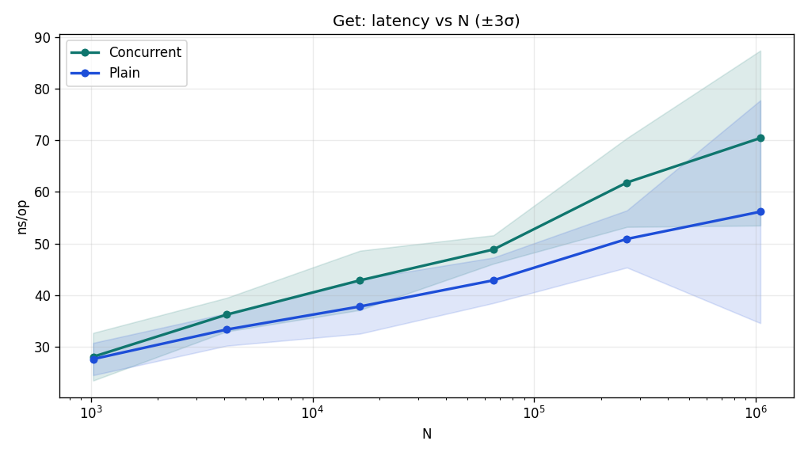
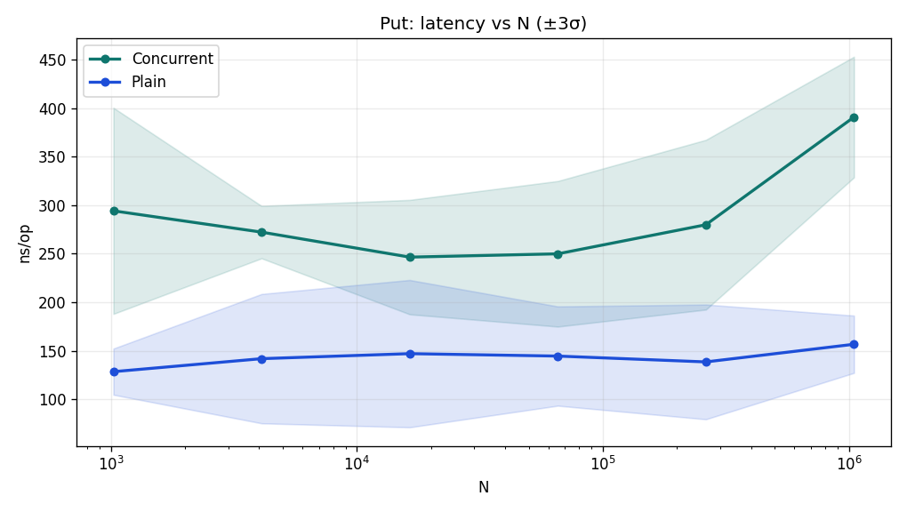
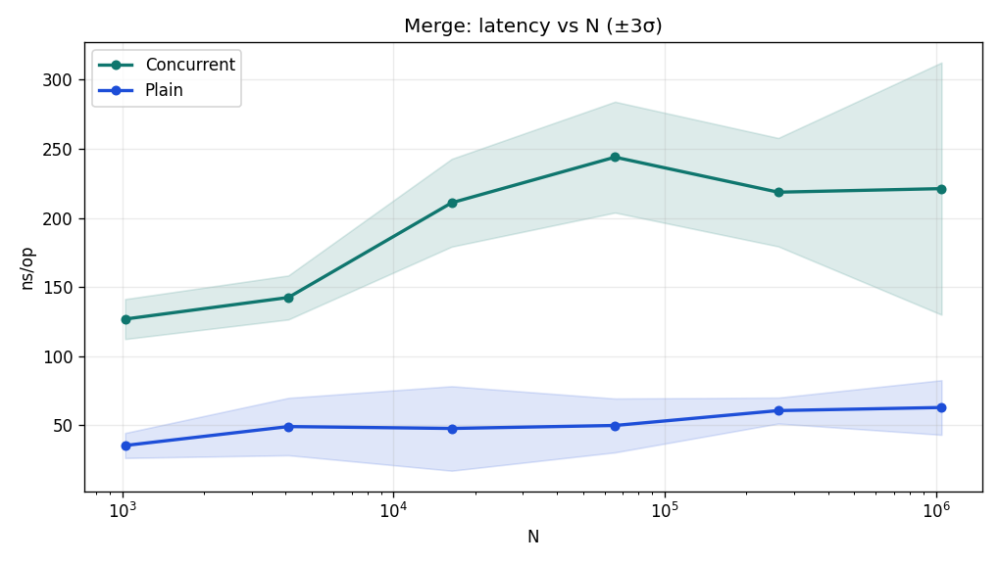
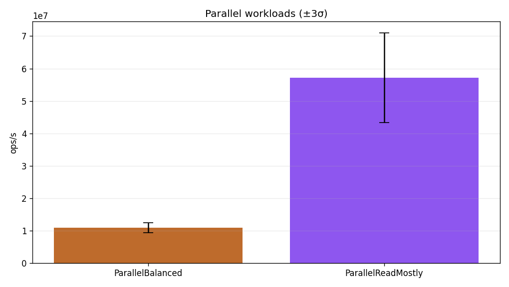

# Лабораторная работа 4: concurrent hash-map

## Состав

| Часть | Значение |
|---|---|
| Структура | thread-safe hash-table, closed addressing |
| Read path | `atomic.Pointer` на immutable snapshot бакета |
| Write path | lock одного бакета + copy-on-write chain |
| Baseline | plain hash-map без синхронизации |
| Операции | `Put`, `Get`, `Merge`, `Size`, `Clear`, `Iterator` |

## Sanity-check графиков

| График | Ожидание | Факт | Статус |
|---|---|---|---|
| `Get` vs `N` | средний `O(1)`, без линейного роста | `28.03 -> 70.44 ns` при `1024 -> 1_048_576` | OK, cache/memory locality |
| `Put` vs `N` | дороже plain из-за lock/COW | `390.94 ns` vs `156.62 ns` на `1M` | OK |
| `Merge` vs `N` | дороже plain, аллокации на clone | `221.18 ns`, `245 B/op` на `1M` | OK |
| Parallel | read-mostly быстрее balanced | `57.1M` vs `10.9M ops/s` | OK |
| CPU profile | hash/compare/atomic, без mutex-доминирования | `Get`, `memequal`, `HashString` | OK |
| Memory profile | write-path allocations | `store`, `cloneEntries` | bottleneck |

## Графики

## Get

| N | Concurrent ns/op (±3σ) | Plain ns/op (±3σ) | Concurrent B/op | Plain B/op |
|---:|---:|---:|---:|---:|
| 1024 | 28.03 ± 4.62 | 27.59 ± 3.13 | 0.0 | 0.0 |
| 4096 | 36.20 ± 3.26 | 33.31 ± 3.14 | 0.0 | 0.0 |
| 16384 | 42.85 ± 5.75 | 37.79 ± 5.28 | 0.0 | 0.0 |
| 65536 | 48.83 ± 2.75 | 42.85 ± 4.41 | 0.0 | 0.0 |
| 262144 | 61.82 ± 8.62 | 50.88 ± 5.54 | 0.0 | 0.0 |
| 1048576 | 70.44 ± 16.96 | 56.16 ± 21.61 | 0.0 | 0.0 |

## Put

| N | Concurrent ns/op (±3σ) | Plain ns/op (±3σ) | Concurrent B/op | Plain B/op |
|---:|---:|---:|---:|---:|
| 1024 | 294.24 ± 106.30 | 128.36 ± 23.81 | 306.0 | 57.2 |
| 4096 | 272.28 ± 27.00 | 141.76 ± 66.69 | 308.0 | 56.0 |
| 16384 | 246.52 ± 58.98 | 146.94 ± 75.98 | 243.0 | 56.2 |
| 65536 | 249.90 ± 75.07 | 144.44 ± 51.20 | 233.0 | 58.0 |
| 262144 | 279.90 ± 87.54 | 138.42 ± 59.17 | 263.0 | 60.4 |
| 1048576 | 390.94 ± 62.23 | 156.62 ± 29.55 | 442.2 | 65.6 |

## Merge

| N | Concurrent ns/op (±3σ) | Plain ns/op (±3σ) | Concurrent B/op | Plain B/op |
|---:|---:|---:|---:|---:|
| 1024 | 126.84 ± 14.46 | 35.41 ± 9.05 | 230.0 | 0.0 |
| 4096 | 142.46 ± 15.92 | 49.08 ± 20.75 | 228.0 | 0.0 |
| 16384 | 210.96 ± 31.75 | 47.72 ± 30.56 | 235.0 | 0.0 |
| 65536 | 243.94 ± 40.10 | 49.88 ± 19.49 | 242.0 | 0.0 |
| 262144 | 218.60 ± 39.21 | 60.64 ± 9.38 | 241.0 | 0.0 |
| 1048576 | 221.18 ± 91.20 | 62.89 ± 19.74 | 245.0 | 0.0 |

## Parallel

| Workload | ns/op (±3σ) | ~ op/s | B/op |
|---|---:|---:|---:|
| `ParallelBalanced` | 91.34 ± 12.27 | 10 948 346 | 120.0 |
| `ParallelReadMostly` | 17.51 ± 4.24 | 57 116 747 | 15.0 |

## Профиль CPU

| flat | flat% | cum | cum% | function |
|---:|---:|---:|---:|---|
| 110ms | 27.50% | 110ms | 27.50% | `runtime.memequal` |
| 70ms | 17.50% | 70ms | 17.50% | `runtime.memclrNoHeapPointers` |
| 40ms | 10.00% | 40ms | 10.00% | `runtime.madvise` |
| 20ms | 5.00% | 20ms | 5.00% | `lab4/concurrentmap.HashString` |
| 10ms | 2.50% | 130ms | 32.50% | `lab4/concurrentmap.(*Map).Get` |

## Профиль Memory

| Метрика | Значение |
|---|---:|
| `store` cumulative | 225.05 MB |
| `cloneEntries` flat | 111.02 MB |
