# Лабораторная работа 5: inverted index search

## Графики

Stress: `1000` запусков каждого запроса по mmap-индексу. Корпус: `11092` фрагментов, `143693` термов, индекс `43.87 MiB`.

<p align="center">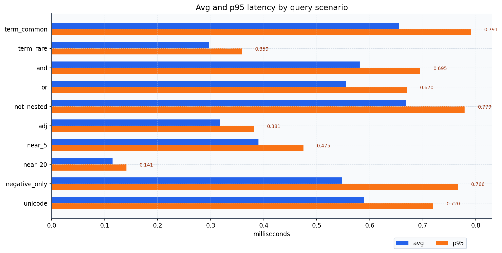</p>
<p align="center">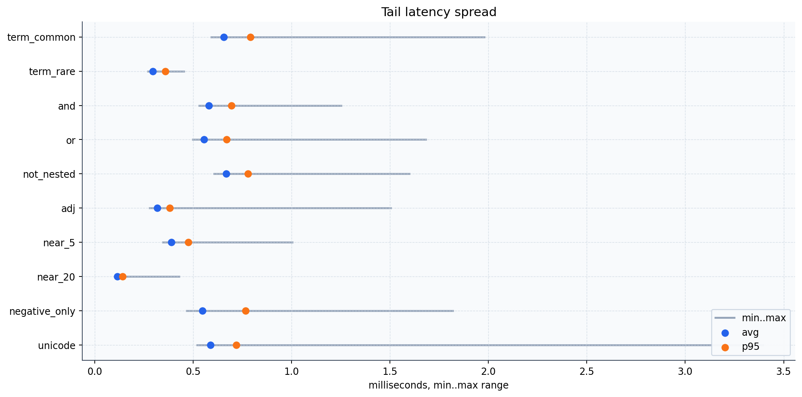</p>
<p align="center">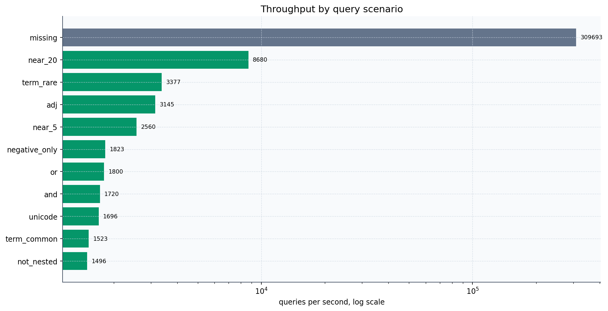</p>
<p align="center">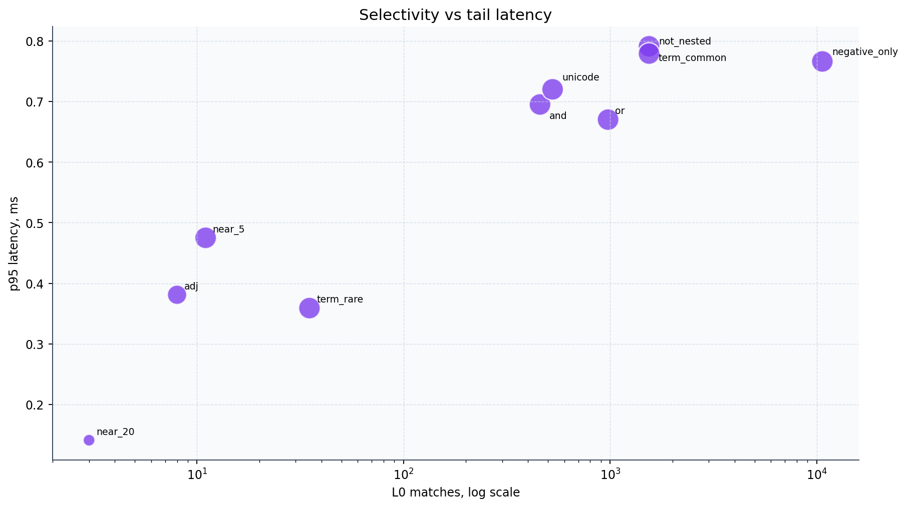</p>
<p align="center">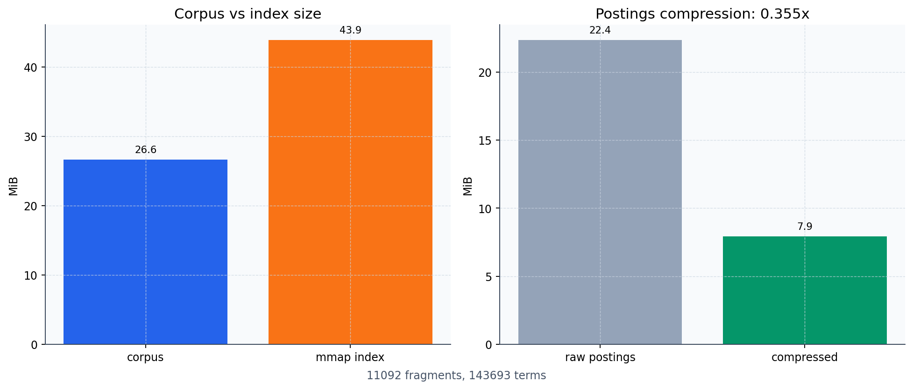</p>

Итог: рабочие запросы в среднем `0.12-0.67 ms`; даже `NOT` по `10635` L0 matches дает `0.548 ms avg / 0.766 ms p95`.

## Stress

| Case | Query | L0 | Ret | avg ms | p95 ms | ~QPS | Error |
|---|---|---:|---:|---:|---:|---:|---|
| `term_common` | `князь` | 1541 | 10 | 0.656 | 0.791 | 1523 |  |
| `term_rare` | `ростовы` | 35 | 10 | 0.296 | 0.359 | 3377 |  |
| `and` | `князь AND андрей` | 457 | 10 | 0.581 | 0.695 | 1720 |  |
| `or` | `пьер OR наташа` | 976 | 10 | 0.555 | 0.670 | 1800 |  |
| `not_nested` | `князь AND NOT (француз AND император)` | 1541 | 10 | 0.668 | 0.779 | 1496 |  |
| `adj` | `пьер ADJ безухов` | 8 | 8 | 0.317 | 0.381 | 3145 |  |
| `near_5` | `андрей NEAR/5 болконский` | 11 | 10 | 0.390 | 0.475 | 2560 |  |
| `near_20` | `наташа NEAR/20 ростова` | 3 | 3 | 0.115 | 0.141 | 8680 |  |
| `negative_only` | `NOT (князь AND андрей)` | 10635 | 10 | 0.548 | 0.766 | 1823 |  |
| `missing` | `несуществующийтерм` | 0 | 0 | 0.003 | 0.003 | 309693 |  |
| `unicode` | `мертвые AND души` | 526 | 10 | 0.589 | 0.720 | 1696 |  |
| `bad_query` | `(князь AND` | 0 | 0 | 0.000 | 0.000 | 0 | `unexpected end of query` |

## Profile

| flat | flat% | cum | cum% | function |
|---:|---:|---:|---:|---|
| 690ms | 13.24% | 690ms | 13.24% | `runtime.decoderune` |
| 550ms | 10.56% | 550ms | 10.56% | `unicode.lookupCaseRange` |
| 440ms | 8.45% | 1100ms | 21.11% | `runtime.stringtoslicerune` |
| 210ms | 4.03% | 210ms | 4.03% | `runtime.memclrNoHeapPointers` |
| 150ms | 2.88% | 150ms | 2.88% | `lab5/search.SearchDetailed.func1` |
| 150ms | 2.88% | 250ms | 4.80% | `lab5/search.unpackBlock` |
| 150ms | 2.88% | 1280ms | 24.57% | `strings.Map` |

<p align="center">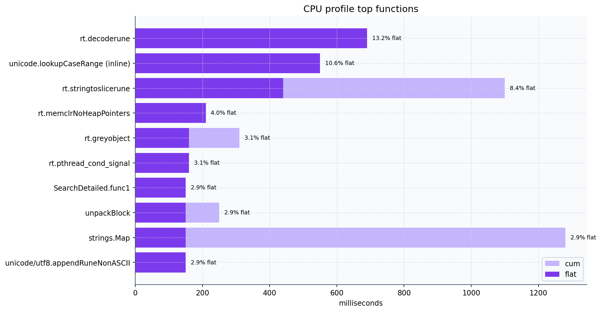</p>
<p align="center">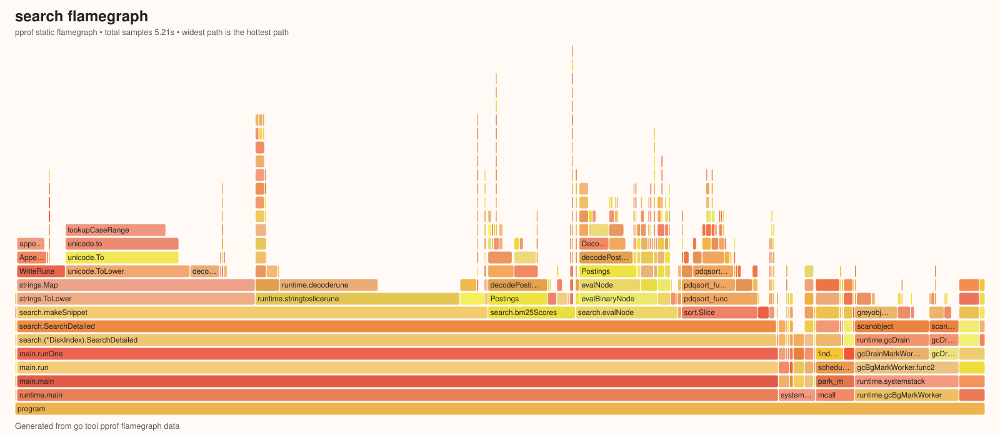</p>

Узкое место: Unicode normalization/snippet path; mmap/decode postings не доминируют.

## UI

<p align="center">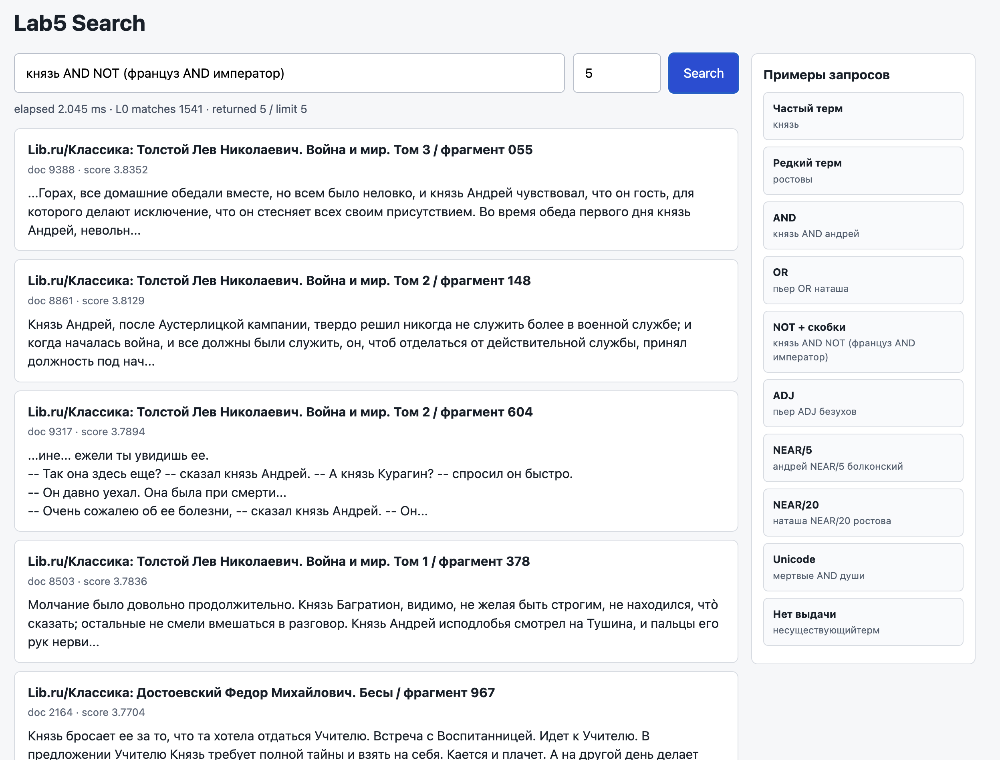</p>
<p align="center">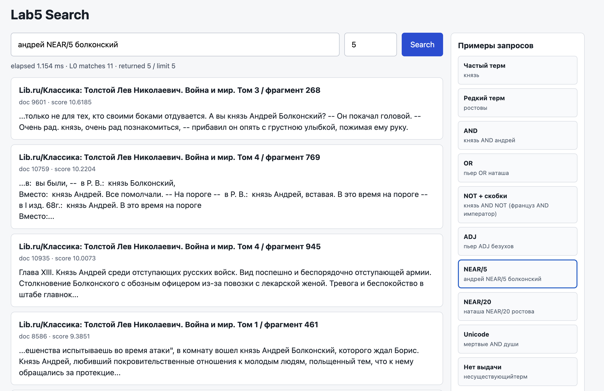</p>
<p align="center">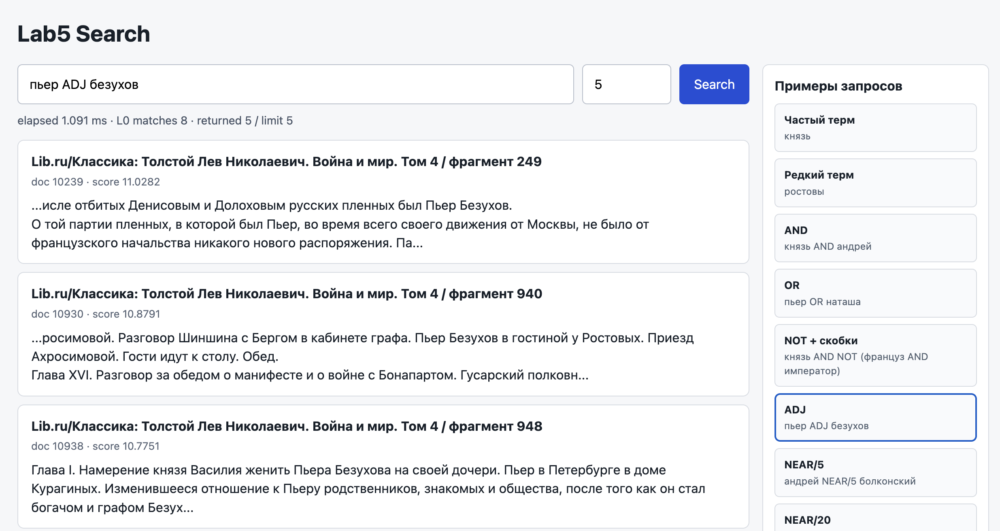</p>
<p align="center">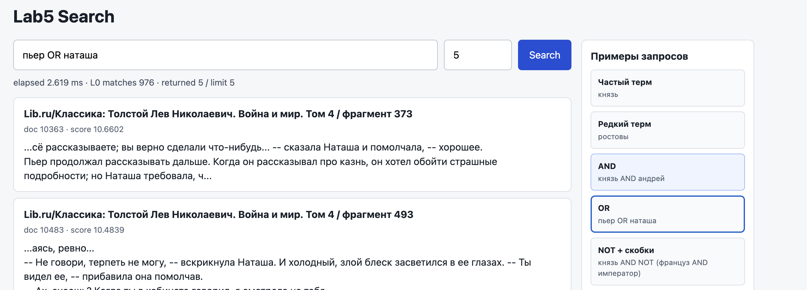</p>

## Запуск

```bash
cd /Users/evgeniyforbes/study/2sem/algo/lab5
make report
make server
```

UI: `http://127.0.0.1:18080`

```bash
go run ./cmd/lab5 search -index data/russian_classics.lab5 -q 'андрей NEAR/5 болконский' -limit 10
go run ./cmd/stress -index data/russian_classics.lab5 -corpus data/russian_classics.jsonl -sources data/src_utf8 -out results/stress.md -rounds 1000 -limit 10 -cpuprofile profiles/search_cpu.prof
```
